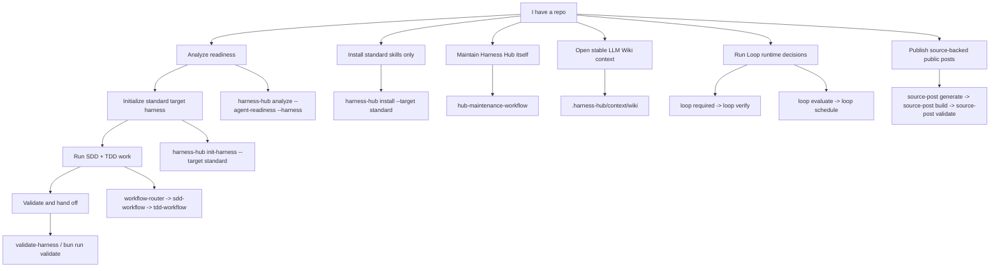

# Harness Hub

[简体中文](README.zh-CN.md) | English

Harness Hub is a personal repo harness toolkit for making agent work repeatable across projects. It installs the target-distributed standard skill/routing set, initializes the standard target harness when requested, validates the result, and keeps managed files safe through lock-backed lifecycle commands.

Imported skills can keep their upstream style; Harness Hub mainly owns routing, source records, harness templates, and lifecycle safety.

Agent execution rules live in synchronized [AGENTS.md](AGENTS.md) and [CLAUDE.md](CLAUDE.md). Human-facing workflow detail lives in [Development Workflow](docs/development-workflow.md), with delegated-agent acceptance and arbitration patterns in [Agentic Loop Catalog](docs/agentic-loop-catalog.md).

## First-Use Summary

Harness Hub does a small set of bounded jobs:

- `check` and `analyze` inspect a target repo and stay read-only.
- `init-harness --target standard` creates the root harness only when you explicitly approve it.
- `install` installs the target-distributed standard skill set only; it does not create root harness files.
- `standard` migrates prompt, context, harness, and loop engineering resources plus reusable skills, while Harness Hub source-maintenance resources stay local to this repository.
- the standard harness includes an LLM Wiki context pack under `.harness-hub/context/`.
- `loop evaluate` and `loop schedule` decide continue vs interrupt and can append local Loop ledgers after `--yes`; `loop required` and `loop verify` derive dirty-path or base/head review gates and block handoff when loop evidence is missing; `loop run-start`, `agent-record`, `lease-check`, `collect-trace`, and `integrate` record local subagent orchestration state under ignored `.harness-hub/state/runs/`.
- `source-post` creates, builds, validates, and preflights source-backed public posts.
- the development workflow keeps Loop as a control plane and adds finish closeout before final handoff: final review, PR/merge readiness, and insight learning.
- agentic loops separate Producer, Verifier, Arbiter, and Main Agent Decision for subagent/delegated-agent acceptance, parallel review, PR closeout, and workflow learning.

For a new target repo, start with a dry run:

```powershell
npx @jasonwen/harness-hub init-harness D:\path\to\target --target standard --dry-run --json
```

Move to `--yes` only after reviewing the planned files. Harness Hub does not create schedules, webhooks, commits, pushes, global skill installs, or remote service changes unless a command explicitly says so.

## Visual Navigator



## Choose A Path

| I want to... | Start here | What it gives you |
|---|---|---|
| Prepare another repo for agent-driven work | `init-harness --target standard` | Standard skills, synchronized root harness files, local state templates, validation script, lock ownership. |
| Install skills without root harness files | `install --target standard` | Full standard skill tree under `skills/<name>/`, no root file changes. |
| Check a target repo before writing files | `analyze --agent-readiness --harness --json` | Read-only readiness, harness gaps, and recommendations. |
| Run a routine status self-check | `self-check --json` | Read-only aggregate status, advisory/failure split, and conditional harness validation. |
| Make installed skills visible to local agents | `activate-agents --yes` | Sync project-local `skills/<name>` into `.codex/skills` and `.claude/skills` without global installation. |
| Mirror this checkout's skills for local agents | `bun run sync:agent-skills` | Sync source `skills/<name>` into local `.codex/skills` and `.claude/skills` mirrors. |
| Validate a bootstrapped repo | `validate-harness --json` | Required files, state, QA boundaries, trigger hygiene, and structural scores. |
| Reuse stable project context | `.harness-hub/context/wiki/index.md` | LLM Wiki schema, source index, contradiction register, update log, and portable Obsidian profile. |
| Evaluate Loop risk | `loop evaluate --input action.json --json` | Continue/interrupt decision, risk signals, evidence needs, and optional ledger recording with `--yes`. |
| Check required closeout loops | `loop required --json` or `loop required --base <ref> --head <ref> --json`, then `loop verify --input verify.json --json` | Dirty-path or commit-range review gates, evidence-level requirements, and handoff blocking when run/integration evidence is missing. |
| Maintain this hub | `workflow-router` then `hub-maintenance-workflow` | Source records, routing, capability metadata, docs, templates, and lifecycle safety. |
| Create a public source-backed post | `source-post generate` | Source ledger, Effective Interact adaptation, Pages output, and publish preflight. |

Harness Hub has one user-facing target path: `standard`. There are no named skill install variants, harness pack levels, or bundle selectors. `standard` is the complete target migration surface for prompt/context/harness/loop engineering and target-distributed reusable skills, including `insight`; Harness Hub source-maintenance workflows such as `hub-maintenance-workflow` stay local to this repository. `harness:minimal` is only the internal component/template ID for the root harness files. Confirmed `install` overwrites an existing same-name skill directory; use `--dry-run` first when a target may already have local skills.

## One-Step Target Bootstrap

Run this against a clean target git worktree:

```powershell
npx @jasonwen/harness-hub init-harness D:\path\to\target --target standard --yes
```

If the target already has root harness files, inspect first:

```powershell
npx @jasonwen/harness-hub init-harness D:\path\to\target --target standard --dry-run --json
```

### Link-only agent bootstrap

If you are an agent working in another repo and received only this Harness Hub repository link, do not copy this checkout into the target. Treat the link as documentation and CLI source.

Use [Bootstrap A Target Repository](BOOTSTRAP-TARGET.md) as the copy-safe contract for this path.

Use the published CLI first:

```powershell
npx @jasonwen/harness-hub@latest init-harness D:\path\to\target --target standard --dry-run --json
npx @jasonwen/harness-hub@latest init-harness D:\path\to\target --target standard --yes
```

If you must run from source, clone this repo outside the target worktree and use it only as a runner:

```powershell
git clone https://github.com/JasonxzWen/harness-hub.git
cd harness-hub
bun install
bun run build
node bin\harness-hub.mjs init-harness D:\path\to\target --target standard --dry-run --json
node bin\harness-hub.mjs init-harness D:\path\to\target --target standard --yes
```

Never copy `.claude-plugin/`, root `openspec/`, `docs/`, `config/`, `capabilities/`, `harness/`, `package.json`, README files, source files, tests, or other Harness Hub source-repo material into the target. If neither the npm CLI nor the source CLI can run, report a bootstrap blocker instead of manually copying folders.

From source:

```powershell
git clone https://github.com/JasonxzWen/harness-hub.git
cd harness-hub
bun install
bun run build
node bin\harness-hub.mjs init-harness D:\path\to\target --target standard --yes
```

## Core Commands

```powershell
bun install
bun run validate
bun run sync:agent-skills

npx @jasonwen/harness-hub analyze D:\path\to\target --agent-readiness --harness --json
npx @jasonwen/harness-hub check D:\path\to\target --json
npx @jasonwen/harness-hub self-check D:\path\to\target --json
npx @jasonwen/harness-hub activate-agents D:\path\to\target --dry-run --json
npx @jasonwen/harness-hub activate-agents D:\path\to\target --yes
npx @jasonwen/harness-hub init-harness D:\path\to\target --target standard --dry-run --json
npx @jasonwen/harness-hub init-harness D:\path\to\target --target standard --yes
npx @jasonwen/harness-hub validate-harness D:\path\to\target --json
npx @jasonwen/harness-hub loop evaluate D:\path\to\target --input action.json --json
npx @jasonwen/harness-hub loop schedule D:\path\to\target --input actions.jsonl --yes --json
npx @jasonwen/harness-hub loop required D:\path\to\target --json
npx @jasonwen/harness-hub loop required D:\path\to\target --base origin/main --head HEAD --json
npx @jasonwen/harness-hub loop run-start D:\path\to\target --input run.json --yes --json
npx @jasonwen/harness-hub loop lease-check D:\path\to\target --input lease.json --yes --json
npx @jasonwen/harness-hub loop verify D:\path\to\target --input verify.json --json
npx @jasonwen/harness-hub loop verify D:\path\to\target --input verify.json --base origin/main --head HEAD --json
npx @jasonwen/harness-hub install D:\path\to\target --target standard --dry-run
npx @jasonwen/harness-hub install D:\path\to\target --target standard --yes
npx @jasonwen/harness-hub status D:\path\to\target --json
npx @jasonwen/harness-hub update D:\path\to\target --dry-run --json
npx @jasonwen/harness-hub remove D:\path\to\target --dry-run --json
```

Legacy `.codex` aggregation targets need the managed standard migration, not another aggregation sync. First run `check` or `self-check`; if the target has `.codex/harness-hub-aggregation.json` but no `.harness-hub/lock.json`, the advisory means the repo may have stale host-local distribution without current managed skills, root harness files, `.harness-hub` state, context pack, Loop ledgers, or later standard capability additions. Review the dry-run, then replace the old harness surface explicitly:

```powershell
npx @jasonwen/harness-hub@latest init-harness D:\path\to\target --target standard --dry-run --json
npx @jasonwen/harness-hub@latest init-harness D:\path\to\target --target standard --yes --force --json
npx @jasonwen/harness-hub@latest activate-agents D:\path\to\target --yes --json
npx @jasonwen/harness-hub@latest validate-harness D:\path\to\target --json
npx @jasonwen/harness-hub@latest check D:\path\to\target --json
```

If `activate-agents` is blocked by old unmarked `.codex/skills` or `.claude/skills` caches and those caches are not needed, remove the caches and rerun `activate-agents`. Do not rerun retired `update-harness-hub` aggregation scripts for current standard targets.

Source-post publishing:

```powershell
npx @jasonwen/harness-hub source-post generate . --input input.json --json
npx @jasonwen/harness-hub source-post build . --json
npx @jasonwen/harness-hub source-post validate . --json
npx @jasonwen/harness-hub source-post publish . --dry-run --json
```

`check` is a read-only startup check. It reports the released CLI package status from npm registry in `cli`, the target repository's lock-managed component status in `target`, and explicit CodeGraph/Headroom configuration advice in `externalTools`; update availability, registry failures, missing locks, missing project-local agent activation, and external tool suggestions are advisory and do not apply updates, install tools, or block the agent startup path.

`activate-agents` is an explicit local activation step for Codex and Claude Code projects. It copies the already installed `skills/<name>` tree into `.codex/skills/<name>` and `.claude/skills/<name>` so both hosts can index the skill metadata, including helper triggers such as `package-release-sniffer`. It writes only the target repository's local host caches, uses a Harness Hub marker to avoid overwriting unmarked local skills, and does not write global skill directories or `.harness-hub/lock.json`.

`self-check` is the routine health-check aggregate. It wraps `check`, classifies hard failures separately from advisory items, and runs strict `validate-harness` only when the target has an installed `harness:minimal` lock record unless `--validate-harness` is explicitly provided. A local daily 21:30 runner can call:

```powershell
npx @jasonwen/harness-hub self-check D:\path\to\target --json
```

Harness Hub does not create the schedule, webhook, commit, push, tool install, or target setup for that command.

## What Is Included

| Area | Included surface |
|---|---|
| Routing and lifecycle | `workflow-router`, owner workflow skills, SDD-first change flow, finish closeout, delivery closeout. |
| Planning and implementation | `grill-me`, `product-capability`, `tdd-workflow`, `karpathy-guidelines`, `verification-loop`. |
| Diagnosis and review | `diagnosis-workflow`, `diagnose`, `review-workflow`, `compound-code-review`, `security-review`. |
| Communication and handoff | `effective-interact`, `handoff`, `doc-coauthoring`, `internal-comms`, `documentation-lookup`. |
| Context engineering | LLM Wiki schema, stable Markdown wiki, contradiction register, update log, portable Obsidian profile. |
| Web and artifacts | `frontend-design`, `design-taste-frontend`, `webapp-testing`, `e2e-testing`, `web-artifacts-builder`, `frontend-slides`, `theme-factory`. |
| Platform extension | `claude-api`, `mcp-builder`, `skill-creator`, source records, capability metadata. |
| External tool advice | `check.externalTools` and `analyze --agent-readiness` signals for explicit CodeGraph and Headroom setup. |
| Harness lifecycle | `check`, `self-check`, `analyze`, `init-harness`, `validate-harness`, `loop evaluate`, `loop schedule`, `loop required`, `loop verify`, loop orchestration state commands, `install`, `status`, `update`, `remove`, `harness-quality-check`. |
| Source-post publishing | `source-post generate`, `source-post build`, `source-post validate`, `source-post publish`. |

## Source Layout

This is the Harness Hub source checkout layout, not the target initialization output. Target initialization never copies `.claude-plugin/`, root `openspec/`, `docs/`, `config/`, `package.json`, this repo's README files, or this repo's source tree into the target root; it writes only lock-managed `skills/<name>/` entries plus the explicit standard target harness files.

```text
skills/
  <skill-name>/
    SKILL.md
    references/   # optional
    scripts/      # optional
    assets/       # optional
harness/
  minimal/          # internal template for the standard target harness
  website-cloner/  # explicit authorized website clone smoke scaffold
.claude-plugin/
  plugin.json
  marketplace.json
```

## Project Map

| Path | Purpose |
|---|---|
| `README.md` / `README.zh-CN.md` | Human-facing entry and visual navigation. |
| `AGENTS.md` / `CLAUDE.md` | Synchronized agent-facing repo rules and execution workflow. |
| `skills/` | Platform-neutral skill source of truth. |
| `harness/` | Standard target harness template and explicit-only smoke scaffolds. |
| `capabilities/index.json` | Skill and harness component metadata. |
| `docs/development-workflow.md` | SDD+TDD workflow guide and state-file responsibilities. |
| `docs/skill-routing.md` | Skill overlap and routing rules. |
| `docs/personal-workflow-distribution.md` | Personal distribution policy. |
| `docs/standard-target-boundary.md` | Single target/install boundary and source-intake rules. |
| `docs/source-projects.md` | Upstream source and decision log. |
| `src/harnessHub.ts` | CLI implementation. |
| `config/artifact-policy.json` | Git/npm artifact inclusion policy. |

Generated reports, worktree-local harness state, interaction artifacts, and local agent skill mirrors stay local: `reports/`, `.harness-hub/reports/`, `.harness-hub/state/`, `skills/effective-interact/artifacts/`, `.codex/`, and `.claude/` are ignored. `site/` is Git-only Pages output and is intentionally excluded from the npm package.

`standard` target installs exclude Harness Hub source-maintenance resources. Keep repository-specific maintenance rules in this source checkout; target repositories receive the managed prompt/context/harness/loop resources and target-distributed reusable skills only.

## Validation

```powershell
bun run typecheck
bun test ./tests
bun run validate:artifact-policy
bun run validate:skills
bun run validate
git diff --check
```

Release validation:

```powershell
bun run validate:release
```
