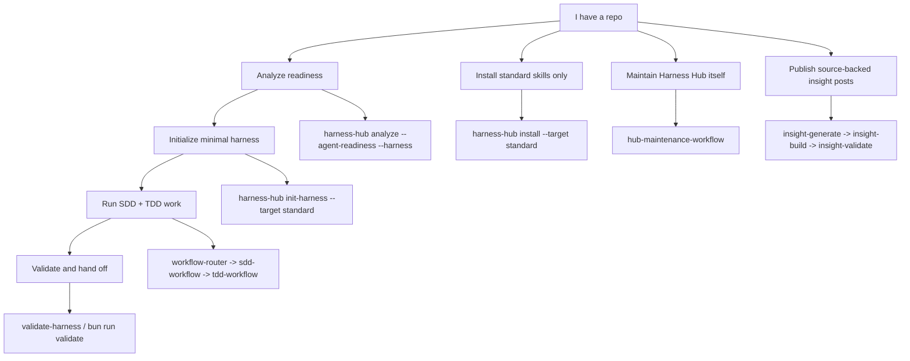

# Harness Hub

[简体中文](README.zh-CN.md) | English

Harness Hub is a personal repo harness toolkit for making agent work repeatable across projects. It installs the full standard skill/routing set, initializes the minimal repo harness when requested, validates the result, and keeps managed files safe through lock-backed lifecycle commands.

Imported skills can keep their upstream style; Harness Hub mainly owns routing, source records, harness templates, and lifecycle safety.

Agent execution rules live in [AGENTS.md](AGENTS.md). Human-facing workflow detail lives in [Development Workflow](docs/development-workflow.md).

## Visual Navigator



## Choose A Path

| I want to... | Start here | What it gives you |
|---|---|---|
| Prepare another repo for Codex-driven work | `init-harness --target standard` | Standard skills, root harness files, local state templates, validation script, lock ownership. |
| Install skills without root harness files | `install --target standard` | Full standard skill tree under `skills/<name>/`, no root file changes. |
| Check a target repo before writing files | `analyze --agent-readiness --harness --json` | Read-only readiness, harness gaps, and recommendations. |
| Validate a bootstrapped repo | `validate-harness --json` | Required files, state, QA boundaries, trigger hygiene, and structural scores. |
| Maintain this hub | `workflow-router` then `hub-maintenance-workflow` | Source records, routing, capability metadata, docs, templates, and lifecycle safety. |
| Create a public source-backed insight post | `insight-*` commands | Source ledger, Effective Interact adaptation, Pages output, and publish preflight. |

Harness Hub has one standard skill install set and one `minimal` harness path. There are no named skill install variants, harness pack levels, or bundle selectors. Confirmed `install` overwrites an existing same-name skill directory; use `--dry-run` first when a target may already have local skills.

## One-Step Target Bootstrap

Run this against a clean target git worktree:

```powershell
npx @jasonwen/harness-hub init-harness D:\path\to\target --target standard --yes
```

If the target already has root harness files, inspect first:

```powershell
npx @jasonwen/harness-hub init-harness D:\path\to\target --target standard --dry-run --json
```

From source:

```powershell
git clone https://github.com/JasonxzWen/harness-hub.git
cd harness-hub
bun install
bun run build
node bin\harness-hub.mjs init-harness D:\path\to\target --target standard --yes
```

## Core Commands

```powershell
bun install
bun run validate
bun run bootstrap:codex-skills

npx @jasonwen/harness-hub analyze D:\path\to\target --agent-readiness --harness --json
npx @jasonwen/harness-hub check D:\path\to\target --json
npx @jasonwen/harness-hub init-harness D:\path\to\target --target standard --dry-run --json
npx @jasonwen/harness-hub init-harness D:\path\to\target --target standard --yes
npx @jasonwen/harness-hub validate-harness D:\path\to\target --json
npx @jasonwen/harness-hub install D:\path\to\target --target standard --dry-run
npx @jasonwen/harness-hub install D:\path\to\target --target standard --yes
npx @jasonwen/harness-hub status D:\path\to\target --json
npx @jasonwen/harness-hub update D:\path\to\target --dry-run --json
npx @jasonwen/harness-hub remove D:\path\to\target --dry-run --json
```

Insight publishing:

```powershell
npx @jasonwen/harness-hub insight-generate . --input input.json --json
npx @jasonwen/harness-hub insight-build . --json
npx @jasonwen/harness-hub insight-validate . --json
npx @jasonwen/harness-hub insight-publish . --dry-run --json
```

`check` is a read-only startup check. It reports the released CLI package status from npm registry in `cli`, the target repository's lock-managed component status in `target`, and explicit CodeGraph/Headroom configuration advice in `externalTools`; update availability, registry failures, missing locks, and external tool suggestions are advisory and do not apply updates, install tools, or block the agent startup path.

## What Is Included

| Area | Included surface |
|---|---|
| Routing and lifecycle | `workflow-router`, owner workflow skills, SDD-first change flow, delivery closeout. |
| Planning and implementation | `grill-me`, `product-capability`, `tdd-workflow`, `karpathy-guidelines`, `verification-loop`. |
| Diagnosis and review | `diagnosis-workflow`, `diagnose`, `review-workflow`, `compound-code-review`, `security-review`. |
| Communication and handoff | `effective-interact`, `handoff`, `doc-coauthoring`, `internal-comms`, `documentation-lookup`. |
| Web and artifacts | `frontend-design`, `design-taste-frontend`, `webapp-testing`, `e2e-testing`, `web-artifacts-builder`, `frontend-slides`, `theme-factory`. |
| Platform extension | `claude-api`, `mcp-builder`, `skill-creator`, source records, capability metadata. |
| External tool advice | `check.externalTools` and `analyze --agent-readiness` signals for explicit CodeGraph and Headroom setup. |
| Harness lifecycle | `check`, `analyze`, `init-harness`, `validate-harness`, `install`, `status`, `update`, `remove`. |

## Source Layout

```text
skills/
  <skill-name>/
    SKILL.md
    references/   # optional
    scripts/      # optional
    assets/       # optional
harness/
  minimal/          # the only supported target bootstrap harness
  website-cloner/  # explicit authorized website clone smoke scaffold
.claude-plugin/
  plugin.json
  marketplace.json
```

## Project Map

| Path | Purpose |
|---|---|
| `README.md` / `README.zh-CN.md` | Human-facing entry and visual navigation. |
| `AGENTS.md` | Agent-facing repo rules and execution workflow. |
| `skills/` | Platform-neutral skill source of truth. |
| `harness/` | Minimal bootstrap harness and explicit-only smoke scaffolds. |
| `capabilities/index.json` | Skill and harness component metadata. |
| `docs/development-workflow.md` | SDD+TDD workflow guide and state-file responsibilities. |
| `docs/skill-routing.md` | Skill overlap and routing rules. |
| `docs/personal-workflow-distribution.md` | Personal distribution policy. |
| `docs/source-projects.md` | Upstream source and decision log. |
| `src/harnessHub.ts` | CLI implementation. |
| `config/artifact-policy.json` | Git/npm artifact inclusion policy. |

Generated reports, worktree-local harness state, interaction artifacts, and Codex dogfood copies stay local: `reports/`, `.harness-hub/reports/`, `.harness-hub/state/`, `skills/effective-interact/artifacts/`, and `.codex/` are ignored. `site/` is Git-only Pages output and is intentionally excluded from the npm package.

## Validation

```powershell
bun run typecheck
bun test ./tests
bun run validate:artifact-policy
bun run validate:skills
bun run validate
git diff --check
```

Release validation:

```powershell
bun run validate:release
```
