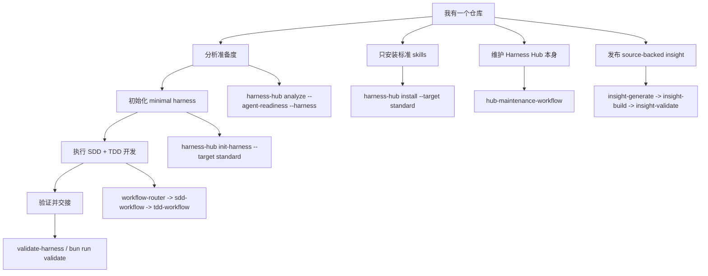

# Harness Hub

简体中文 | [English](README.md)

Harness Hub 是一个个人仓库 harness 工具箱，用来让 agent 在多个项目中的工作方式可重复、可验证、可交接。它会安装完整的标准 skill/路由集合，在明确请求时初始化 `minimal` 仓库 harness，验证结果，并通过 lock-backed lifecycle 命令安全维护托管文件。

Imported skills 可以保留上游风格；Harness Hub 主要负责路由、source records、harness 模板和 lifecycle safety。

agent 执行规则放在 [AGENTS.md](AGENTS.md)。面向人的开发流程说明放在 [Development Workflow](docs/development-workflow.md)。

## 首次理解

Harness Hub 只做三类有边界的事：

- `check` 和 `analyze` 只读检查目标仓库。
- `init-harness` 只在你显式确认后创建 minimal 根级 harness。
- `install` 只安装标准 skill set，不创建根级 harness 文件。

第一次处理目标仓库时，先 dry-run：

```powershell
npx @jasonwen/harness-hub init-harness D:\path\to\target --target standard --dry-run --json
```

看懂计划文件后再加 `--yes`。Harness Hub 不会替你创建定时任务、webhook、commit、push、全局 skill 安装或远程服务改动，除非某条命令明确声明这类副作用。

## 可视化导航



## 选择入口

| 我想要... | 从这里开始 | 得到什么 |
|---|---|---|
| 让另一个仓库适合 Codex 驱动开发 | `init-harness --target standard` | 标准 skills、根级 harness 文件、本地 state 模板、验证脚本、lock ownership。 |
| 只安装 skills，不写根级 harness 文件 | `install --target standard` | 完整标准 skill 树，写到 `skills/<name>/`。 |
| 写文件前先检查目标仓库 | `analyze --agent-readiness --harness --json` | 只读 readiness、harness 缺口和建议。 |
| 执行例行状态自检 | `self-check --json` | 只读聚合状态、自检 advisory/failure 分流和条件化 harness 验证。 |
| 让已安装 skills 被本地 Codex 看见 | `activate-codex --yes` | 把项目内 `skills/<name>` 同步到 `.codex/skills`，不做全局安装。 |
| 验证已初始化的仓库 | `validate-harness --json` | 必需文件、state、QA 边界、trigger hygiene 和结构评分。 |
| 维护 Harness Hub 自身 | `workflow-router` 再进入 `hub-maintenance-workflow` | source records、routing、capability metadata、docs、templates、lifecycle safety。 |
| 创建公开 source-backed insight post | `insight-*` 命令 | source ledger、Effective Interact adaptation、Pages 输出和发布预检。 |

Harness Hub 只有一个标准 skill install set 和一个 `minimal` harness 路径。没有 named skill install variants、harness pack levels 或 bundle selectors。确认执行 `install` 会覆盖同名 skill 目录；如果目标仓库可能已有本地 skills，先用 `--dry-run` 检查。

## 一步初始化目标仓库

在干净的目标 git worktree 中运行：

```powershell
npx @jasonwen/harness-hub init-harness D:\path\to\target --target standard --yes
```

如果目标已经有根级 harness 文件，先检查计划：

```powershell
npx @jasonwen/harness-hub init-harness D:\path\to\target --target standard --dry-run --json
```

从源码运行：

```powershell
git clone https://github.com/JasonxzWen/harness-hub.git
cd harness-hub
bun install
bun run build
node bin\harness-hub.mjs init-harness D:\path\to\target --target standard --yes
```

## 核心命令

```powershell
bun install
bun run validate
bun run bootstrap:codex-skills

npx @jasonwen/harness-hub analyze D:\path\to\target --agent-readiness --harness --json
npx @jasonwen/harness-hub check D:\path\to\target --json
npx @jasonwen/harness-hub self-check D:\path\to\target --json
npx @jasonwen/harness-hub activate-codex D:\path\to\target --dry-run --json
npx @jasonwen/harness-hub activate-codex D:\path\to\target --yes
npx @jasonwen/harness-hub init-harness D:\path\to\target --target standard --dry-run --json
npx @jasonwen/harness-hub init-harness D:\path\to\target --target standard --yes
npx @jasonwen/harness-hub validate-harness D:\path\to\target --json
npx @jasonwen/harness-hub install D:\path\to\target --target standard --dry-run
npx @jasonwen/harness-hub install D:\path\to\target --target standard --yes
npx @jasonwen/harness-hub status D:\path\to\target --json
npx @jasonwen/harness-hub update D:\path\to\target --dry-run --json
npx @jasonwen/harness-hub remove D:\path\to\target --dry-run --json
```

Insight publishing：

```powershell
npx @jasonwen/harness-hub insight-generate . --input input.json --json
npx @jasonwen/harness-hub insight-build . --json
npx @jasonwen/harness-hub insight-validate . --json
npx @jasonwen/harness-hub insight-publish . --dry-run --json
```

`check` 是只读启动检查。它在 `cli` 报告 npm 上的 CLI 包状态，在 `target` 报告目标仓库 lock 托管组件状态，并在 `externalTools` 给出 CodeGraph 和 Headroom 的显式配置/安装建议；更新可用、registry 失败、缺少 lock、缺少项目本地 Codex 激活、外部工具建议都只是 advisory，不会安装工具、改写目标仓库或阻塞 agent 启动路径。

`activate-codex` 是显式的 Codex 项目本地激活步骤。它把已经安装在目标仓库里的 `skills/<name>` 复制到 `.codex/skills/<name>`，让 Codex 能索引 skill metadata，包括 `package-release-sniffer` 这类 helper 触发。它只写目标仓库本地 `.codex/skills` 缓存，用 Harness Hub marker 避免覆盖未标记的本地 Codex skill，不写全局 skill 目录，也不写 `.harness-hub/lock.json`。

`self-check` 是例行健康自检聚合命令。它包装 `check`，把硬失败和 advisory 分开，并且只有在目标已有 `harness:minimal` 安装 lock 记录时默认运行严格 `validate-harness`；如果要强制验证未初始化目标，需要显式加 `--validate-harness`。本地每天 21:30 的 runner 可以调用：

```powershell
npx @jasonwen/harness-hub self-check D:\path\to\target --json
```

Harness Hub 不会为这条命令创建定时任务、webhook、commit、push、工具安装或目标 setup。

## 包含能力

| 领域 | 包含内容 |
|---|---|
| 路由与生命周期 | `workflow-router`、owner workflow skills、SDD-first 变更流、delivery closeout。 |
| 计划与实现 | `grill-me`、`product-capability`、`tdd-workflow`、`karpathy-guidelines`、`verification-loop`。 |
| 诊断与评审 | `diagnosis-workflow`、`diagnose`、`review-workflow`、`compound-code-review`、`security-review`。 |
| 沟通与交接 | `effective-interact`、`handoff`、`doc-coauthoring`、`internal-comms`、`documentation-lookup`。 |
| Web 与 artifacts | `frontend-design`、`design-taste-frontend`、`webapp-testing`、`e2e-testing`、`web-artifacts-builder`、`frontend-slides`、`theme-factory`。 |
| 平台扩展 | `claude-api`、`mcp-builder`、`skill-creator`、source records、capability metadata。 |
| 外部工具建议 | `check.externalTools` 和 `analyze --agent-readiness` 会给出显式 CodeGraph 与 Headroom 配置建议。 |
| Harness lifecycle | `check`、`self-check`、`analyze`、`init-harness`、`validate-harness`、`install`、`status`、`update`、`remove`。 |

## Source Layout

```text
skills/
  <skill-name>/
    SKILL.md
    references/   # optional
    scripts/      # optional
    assets/       # optional
harness/
  minimal/          # 唯一支持的目标 bootstrap harness
  website-cloner/  # 显式授权的网站克隆 smoke scaffold
.claude-plugin/
  plugin.json
  marketplace.json
```

## 项目地图

| 路径 | 用途 |
|---|---|
| `README.md` / `README.zh-CN.md` | 面向人的入口和可视化导航。 |
| `AGENTS.md` | 面向 agent 的仓库规则和执行工作流。 |
| `skills/` | 平台中立的 skill source of truth。 |
| `harness/` | Minimal bootstrap harness 和 explicit-only smoke scaffolds。 |
| `capabilities/index.json` | Skill 与 harness component metadata。 |
| `docs/development-workflow.md` | SDD+TDD 工作流指南和 state-file 职责。 |
| `docs/skill-routing.md` | Skill 重叠边界和路由规则。 |
| `docs/personal-workflow-distribution.md` | 个人分发策略。 |
| `docs/source-projects.md` | 上游来源和决策日志。 |
| `src/harnessHub.ts` | CLI 实现。 |
| `config/artifact-policy.json` | Git/npm artifact inclusion policy。 |

生成报告、worktree-local harness state、interaction artifacts 和 Codex dogfood copies 保持本地：`reports/`、`.harness-hub/reports/`、`.harness-hub/state/`、`skills/effective-interact/artifacts/` 和 `.codex/` 被忽略。`site/` 是 Git-only Pages 输出，并且有意排除在 npm package 之外。

## 验证

```powershell
bun run typecheck
bun test ./tests
bun run validate:artifact-policy
bun run validate:skills
bun run validate
git diff --check
```

Release 验证：

```powershell
bun run validate:release
```
