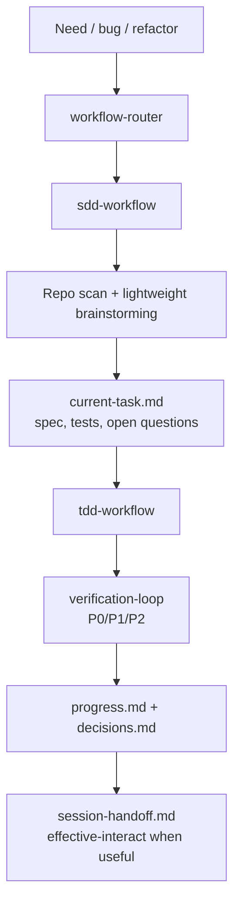

# Capability Map

Harness Hub exposes three surfaces:

- a personal distributed skill set under `skills/`;
- one supported target bootstrap harness under `harness/minimal/`;
- a lifecycle CLI that can analyze, initialize, validate, self-check, install, update, status-check, and remove managed target-repo assets.

It also owns two explicit higher-level repo capabilities: Codex dev harness bootstrap through `init-harness`, and source-backed insight publishing through `insight-*`.

For the default requirement-to-delivery lane, see [Development Workflow](development-workflow.md). It explains how `workflow-router`, `sdd-workflow`, lightweight brainstorming, `tdd-workflow`, validation helpers, `effective-interact`, and `.harness-hub/state/` fit together during normal feature, bug-fix, refactor, and product-change work.

## Default Development Flow

## CLI Commands

| Command | Mutates target? | Purpose |
|---|---:|---|
| `harness-hub check <target>` | No | Report CLI package freshness, target lock-managed component freshness, and explicit CodeGraph/Headroom configuration advice without applying updates or installing tools. |
| `harness-hub self-check <target>` | No | Aggregate read-only health status, split hard failures from advisory items, and run strict harness validation only for initialized harness targets unless explicitly requested. |
| `harness-hub analyze <target>` | No | Detect existing standard skills, missing capabilities, conflicts, and recommendations. |
| `harness-hub analyze <target> --harness` | No | Detect repo harness gaps, existing root harness evidence, and initialization recommendations. |
| `harness-hub init-harness <target> --dry-run` | No | Preview root harness initialization without writing files or lock state. |
| `harness-hub init-harness <target> --yes` | Yes | Write minimal harness files after blockers pass and record ownership in `.harness-hub/lock.json`. |
| `harness-hub validate-harness <target>` | No | Validate required minimal harness files, QA boundaries, agent architecture boundaries, skill trigger hygiene, the five harness subsystems, and a structural benchmark. |
| `harness-hub activate-codex <target> --dry-run` | No | Preview syncing installed project-local skills into `.codex/skills` for Codex metadata activation. |
| `harness-hub activate-codex <target> --yes` | Yes | Write only the target repository's local `.codex/skills` activation cache; no global skills and no lock ownership changes. |
| `harness-hub install <target> --target standard --dry-run` | No | Preview managed installation of every standard skill. |
| `harness-hub install <target> --target standard --yes` | Yes | Copy every managed standard skill and write `.harness-hub/lock.json`. |
| `harness-hub init-harness <target> --target standard --dry-run` | No | Preview standard skill installation plus Codex-only root harness files. |
| `harness-hub init-harness <target> --target standard --yes` | Yes | Install standard skills, write managed root harness files, and validate the harness. |
| `harness-hub validate-harness <target> --json` | No | Check required harness files, Codex-only boundary, current-state file sizes, QA boundaries, agent architecture boundaries, skill trigger hygiene, five-subsystem assessment, project verification detection, and structural benchmark results. |
| `harness-hub insight-generate <target> --input file --json` | Yes | Validate a structured source record, write post metadata, adapt through `effective-interact`, and generate public post HTML. |
| `harness-hub insight-build <target> --json` | Yes | Build `site/index.html`, `site/insights/index.html`, and `site/insights/index.json` from post metadata. |
| `harness-hub insight-validate <target> --json` | No | Validate UTF-8, source attribution, fact/inference separation, links, excerpt size, indexes, and public artifact boundaries. |
| `harness-hub insight-publish <target> --dry-run --json` | No | Run Pages publish preflight for workflow, Pages output, source metadata, branch, and worktree state. |
| `harness-hub status <target>` | No | Compare lock records with current files and hub versions. |
| `harness-hub update <target> --dry-run` | No | Plan updates for managed skills. |
| `harness-hub update <target> --yes` | Yes | Update managed, unmodified files. |
| `harness-hub remove <target> --dry-run` | No | Preview removal of lock-recorded files. |
| `harness-hub remove <target> --yes` | Yes | Remove only managed files recorded in `.harness-hub/lock.json`. |

## Install Surface

Harness Hub has one personal skill install set and one harness level: `minimal`. No named skill variants exist. No bundle selectors, advanced packs, language-specific harness levels, or team harness levels exist. The CLI installs the complete standard skill set: every `kind: "skill"` component in `capabilities/index.json` whose source lives under `skills/<name>/`. Confirmed install overwrites same-name skill directories and records the new managed files in `.harness-hub/lock.json`.

Harness components use explicit lifecycle commands. `install` never writes root harness files or worktree-local state. `init-harness --target standard --yes` is the one-step migration path: it installs the full standard skill and routing surface, writes stable files such as `AGENTS.md`, `feature_list.json`, `clean-state-checklist.md`, `definition-of-done.md`, `evaluator-rubric.md`, `quality-document.md`, and `scripts/harness-validate.mjs`, writes ignored worktree-local progress, decision, current-task, and handoff state under `.harness-hub/state/`, validates the harness, and records confirmed writes as harness components in the same lock. It does not copy Harness Hub source-repo packaging or maintenance artifacts such as `.claude-plugin/`, root `openspec/`, `docs/`, `config/`, `package.json`, README files, or this repo's source tree into target roots. `activate-codex --yes` is a separate host-local activation cache sync from `skills/` to `.codex/skills/`; it is not global installation and is not a managed capability target. Local state files and Codex activation cache files are not treated as content-drift blockers. The minimal harness now records PR closeout policy so PR creation or update is followed by mergeability, CI/check-run, conflict, and branch-protection status before final delivery.

Insight publishing is intentionally outside the managed install set. Its public source lives under Git-only `site/`; ignored local artifacts such as `.harness-hub/reports/` and `skills/effective-interact/artifacts/` are not valid Pages sources.

## Atomic Capability Candidate Map

This map separates current installable capabilities from source-backed atom candidates. It is intentionally not an install graph or future pack menu. Promote candidates into `capabilities/index.json` only after source review, routing placement, and lifecycle-risk placement. Harness candidates must improve the single minimal path or stay out of the install surface.

| Capability area | Current installable coverage | Source-backed atom candidates | Gap and decision |
|---|---|---|---|
| Planning, specs, and product clarification | `workflow-router`, `sdd-workflow`, `product-capability`, `grill-me`, OpenSpec formal skills | User-selected: Matt Pocock `design-an-interface`, `request-refactor-plan`, `ubiquitous-language`, `grill-with-docs`, `to-prd`, `zoom-out`; Superpowers `brainstorming`, `writing-plans` | Strong coverage. Candidate work should dedupe against SDD and OpenSpec rather than add broad triggers. Ralph PRD/story-loop skills were retired because native Codex and Claude Code goal/story workflows now cover that lane. |
| Implementation workflow and engineering governance | `sdd-workflow`, `tdd-workflow`, `prototype`, `verification-loop`, `karpathy-guidelines`, lifecycle CLI | User-selected: Matt Pocock `prototype`, `tdd`, `scaffold-exercises`; Superpowers `executing-plans`, `finishing-a-development-branch`, `using-git-worktrees`, `subagent-driven-development`, `writing-skills`; `vercel-labs/skills` `find-skills`; `multica-ai/andrej-karpathy-skills` | Strong coverage. Treat Superpowers as source patterns for orchestration policy, not default always-on skills. Karpathy guidelines are a helper baseline, not another lifecycle owner. |
| Debugging, verification, and review | `diagnosis-workflow`, `diagnose`, `review-workflow`, `compound-code-review`, `security-review`, `verification-loop`, `webapp-testing`, `e2e-testing` | User-selected: Superpowers `systematic-debugging`, `verification-before-completion`, `requesting-code-review`, `receiving-code-review`; Vercel `web-design-guidelines` | Strong coverage. `web-design-guidelines` remains a good UI audit atom candidate. |
| Frontend and visual artifacts | `frontend-design`, `design-taste-frontend`, `clone-website`, `web-artifacts-builder`, `frontend-slides`, `frontend-patterns`, `effective-interact`, `web-design-guidelines`, `theme-factory`, `slack-gif-creator` | User-selected: `frontend-slides`, Michal Vavra `agent-browser`, `frontend-design`, `html-tools`; Anthropic `algorithmic-art`, `canvas-design`, `frontend-design`, `slack-gif-creator`, `theme-factory`, `web-artifacts-builder`, `webapp-testing`; Leonxlnx `taste-skill`; `JCodesMore/ai-website-cloner-template` | `taste-skill` is now installed as a narrow `design-taste-frontend` taste layer for landing pages, portfolios, marketing pages, and redesigns. `clone-website` covers explicit authorized website reconstruction only; generic frontend creation still routes to `frontend-design`. |
| Writing, handoff, knowledge, and learning | `doc-coauthoring`, `internal-comms`, `stop-slop`, `handoff`, `feynman-learning-coach`, `answer-workflow`, `documentation-lookup`, `effective-interact` | User-selected: Matt Pocock `writing-beats`, `writing-fragments`, `writing-shape`, `edit-article`, `handoff`; Anthropic `doc-coauthoring`, `internal-comms`, `brand-guidelines`; hardikpandya `stop-slop` | Filled collaborative doc, internal comms, and narrow English prose AI-tell cleanup gaps. `stop-slop` is a strong style editor, not a default rule for specs, status reports, Chinese output, or code explanation. |
| Release and source monitoring | `package-release-sniffer`, `documentation-lookup`, `answer-workflow`, `source-to-insight-blog` | Local recurring need: sniff newly published AI/developer-tool packages before they appear in broad news or trend lists | `package-release-sniffer` fills the primary-source package registry and release-feed discovery gap while staying source-only. It does not install registry clients, hooks, credentials, monitors, or package publishing behavior. |
| Documents, spreadsheets, slides, and PDFs | No installable Harness Hub atoms. External app skills exist in this Codex environment, but they are not repo-distributed Harness Hub components. | Anthropic `docx`, `pdf`, `pptx`, `xlsx` | Clear capability gap. Treat as high-value source candidates, but source-available licensing requires review before copying or redistributing. |
| Agent platform, API, and skill authoring | `hub-maintenance-workflow`, `skill-quality-inventory`, `documentation-lookup`, `claude-api`, `mcp-builder`, `skill-creator` | Anthropic `claude-api`, `mcp-builder`, `skill-creator`; Matt Pocock `write-a-skill`; Superpowers `writing-skills`; ECC stocktake and agent-architecture audit patterns | Filled MCP, provider-specific Claude API, and skill-authoring gaps with explicit atoms. `claude-api` remains live-doc-first because API details change. ECC-style stocktake and trigger-noise audits are useful source ideas for minimal-path quality gates, not a separate governance tier. |
| Repo harness initialization and governance | `harness-quality-check`, `analyze --harness`, `init-harness`, `validate-harness`, lock-backed status/update/remove, `harness/website-cloner` as explicit smoke scaffold | `walkinglabs/learn-harness-engineering`, `revfactory/harness`, ECC, and similar harness sources as evaluated reference material; `JCodesMore/ai-website-cloner-template` as website reconstruction source; local Codex workflow-course reflection | `harness-quality-check` now composes existing self-check, readiness, harness validation, and skill-quality evidence into advisory HTML reports. Keep the minimal local harness template installable through explicit commands only. High-ROI ideas such as five-subsystem assessment, structural benchmarks, team-architecture patterns, QA boundary checks, stocktake workflows, and trigger-noise audits fold into the same minimal path through `validate-harness`; do not create advanced packs or optional levels. Website-cloner is an explicit high-risk scaffold, not part of default skill install or ordinary frontend routing. |
| External tools and enterprise integrations | `check.externalTools` and `analyze --agent-readiness` provide advisory CodeGraph/Headroom setup signals; no installable Harness Hub components. | User-selected: `colbymchenry/codegraph`, `chopratejas/headroom`, archived Michal Vavra `asncli`, `gogcli`, `snowcli`; CE Slack/release/session candidates from the broader source pool | Keep explicit-only until connector, credential, and side-effect boundaries are specified. CodeGraph and Headroom advice stays manual/reviewed rather than lock-managed. |

## Local Alignment Notes

Current strengths:

- Workflow ownership is clear: `workflow-router` selects one owner, then owner workflows call atoms.
- Normal change work now has an explicit development lane: requirement intake, repo/source inspection, lightweight brainstorming, spec and P0/P1/P2 test matrix, TDD execution, validation, and state-file handoff.
- Repo harness ownership is explicit: root files are initialized only through `init-harness --target standard`, not through default skill installation.
- Engineering lifecycle coverage is strong: SDD, TDD, Karpathy-style coding behavior guardrails, P0/P1/P2 validation priorities, Web browser acceptance, PR status closeout, diagnosis, review, verification, handoff, and Harness Hub maintenance are all installable.
- Web/artifact coverage is strong after adding `theme-factory` and `design-taste-frontend`; production UI, frontend taste direction, standalone artifacts, slides, one-off browser checks, agent-run Web browser acceptance, and durable E2E have separate lanes. `effective-interact` also has a report-only aesthetic preflight derived from `taste-skill`.
- Writing coverage is now viable for docs, internal comms, and narrow English prose cleanup after adding `doc-coauthoring`, `internal-comms`, and `stop-slop`.
- Release/source monitoring now has a small package-release lane: `package-release-sniffer` handles primary-source registry and release-feed discovery for AI/developer-tool packages without taking on implementation or automation side effects.
- Repo/harness quality review now has an advisory HTML lane: `harness-quality-check` composes existing deterministic checks for Hub source and target repositories without adding enforcement, schedules, hooks, or remote writes.
- Platform-extension coverage now has explicit atoms for Claude API, MCP servers, and skill authoring.

Known gaps:

- Native document/spreadsheet/PDF/PPT editing remains a distribution gap because Anthropic `docx`, `pdf`, `pptx`, and `xlsx` are source-available, not open source.
- Standalone brainstorming remains intentionally uninstalled. It is currently an SDD phase action composed from repo inspection, direction comparison, `grill-me`, `prototype`, and `product-capability`; promote it only if repeated routing evidence proves a bounded helper gap.
- External harness, team-architecture, and stocktake ideas still need careful extraction; accepted ideas must improve the minimal path instead of creating another install level. Website-cloner is intentionally explicit and high-risk because it touches external sites, browser evidence, and potential third-party brand assets.
- Cloud/provider coverage is Vercel-heavy; AWS/GCP/Azure, data/ML operations, security operations, and enterprise SaaS integrations still need additional reviewed sources.
- Brand workflow remains generic-only; Anthropic `brand-guidelines` was not imported because it is Anthropic-specific.
- `docs/harness-packs.md` documents the minimal-only policy; only `minimal` is explicit-init capable.

Known redundancies:

- Anthropic `frontend-design`, `web-artifacts-builder`, and `webapp-testing` overlap existing Harness Hub atoms and should not be duplicated.
- Superpowers remains useful as orchestration source material, but direct broad-trigger imports would duplicate workflow-owner behavior.
- ECC is excluded from the candidate pool; existing local ECC-derived lineage should be replaced gradually only when a better reviewed atom exists.

## Candidate Intake Rules

- A selected atom is not installable until its source license, trigger contract, side effects, overlaps, and lifecycle risk are recorded.
- Prefer importing or adapting one bounded skill at a time over importing a repo or plugin bundle.
- Preserve upstream skill bodies by default; put local routing and safety decisions in the overlay unless the upstream body blocks safe personal distribution.
- Keep host-specific paths, hooks, UI metadata, and credential assumptions outside local routing/workflow layers.
- Do not create a new install level, harness pack tier, or selector; fold the idea into the standard minimal path or keep it out.
- Document skills from `anthropics/skills` fill a real map gap, but `docx`, `pdf`, `pptx`, and `xlsx` require license review before redistribution.

## Routing Anchors

- `workflow-router` owns intent recognition for non-trivial work and must hand off to exactly one owner.
- `sdd-workflow` owns SDD-first change work: align user need, gather source material, write spec/acceptance, write an executable plan, clean only approved files, implement, test, and deliver.
- `answer-workflow`, `diagnosis-workflow`, `review-workflow`, `delivery-workflow`, and `hub-maintenance-workflow` own their matching lifecycle states.
- `doc-coauthoring`, `internal-comms`, `stop-slop`, `design-taste-frontend`, `theme-factory`, `package-release-sniffer`, `harness-quality-check`, `claude-api`, `mcp-builder`, `skill-creator`, and `slack-gif-creator` are helper atoms, not top-level workflow owners.
- `karpathy-guidelines` is a helper behavior baseline for assumption surfacing, simplicity, surgical changes, and verification criteria inside implementation, review, or refactor work.
- `diagnose` owns unknown runtime bugs and performance regressions.
- `tdd-workflow` owns known behavior changes that should be implemented through tests.
- `webapp-testing` owns one-off local browser inspection and agent-run Web browser acceptance evidence; `e2e-testing` owns durable Playwright suites.
- `prototype` owns disposable learning artifacts only.
- `verification-loop` owns final command gates.
- `compound-code-review` owns deep review reports.
- `effective-interact` owns Chinese-first complex communication structure: plain briefs, structured Markdown, visual Markdown, ignored long-task fact ledgers, and HTML artifacts for material repo/skill handoffs, option approvals, implementation plans, PR writeups, architecture/dependency/milestone maps, structure trees, status/incident dashboards, research explainers, review artifacts, and lightweight export editors. Its HTML reports should start from visual language that reduces interaction time and information loss, not Markdown-in-HTML. `grill-me` owns pressure testing, `frontend-design` owns production UI, and `frontend-slides` owns decks.
- `design-taste-frontend` owns anti-template visual direction and pre-flight critique for landing pages, portfolios, marketing pages, and redesigns. It should not own dashboards, data tables, multi-step product UI, routine frontend logic, HTML reports, or decks.
- `stop-slop` owns English prose AI-tell cleanup only. It should not become a default writing policy for technical specs, ordinary documentation, Chinese output, code explanation, or status reports.
- `clone-website` owns explicit authorized website reconstruction only. It should not own generic redesign, visual inspiration, scraping, impersonation, or production UI work that starts from a new product brief.

## Metadata Rules

`capabilities/index.json` is the component graph. Skill components use:

- `path`: source path under `skills/<name>`;
- `detects`: standard target evidence such as `skills/<name>/SKILL.md`;
- `agents`: currently `["standard"]` for lock compatibility with older schema field names;
- `risk`: lifecycle risk for install/update/remove decisions.

Do not add host-specific install directories to the capability graph. Packaging for a host belongs in that host's manifest layer, such as `.claude-plugin/`. Local Codex dogfooding uses `scripts/check-codex-worktree.mjs` as a read-only preflight and `scripts/setup-codex-worktree.mjs` to generate ignored `.codex/skills/` copies from the standard source tree plus missing `.harness-hub/state/` templates; `scripts/install-codex-worktree-hook.mjs` can explicitly install an advisory local `post-checkout` hook that runs the same setup after ordinary `git worktree add`; target repositories use `harness-hub activate-codex <target> --yes` only as an explicit project-local cache sync after skills are installed. `.codex/` and `.harness-hub/state/` stay local and are not installable capability metadata. Subagents and hooks are workflow-owned optimizations: subagents need independent scopes, and hooks stay advisory until reviewed and approved.

Harness components currently live under `harness/minimal/`, but they are not part of default standard skill install. They are copied only by explicit harness lifecycle commands and must stay free of host-local runner metadata.
