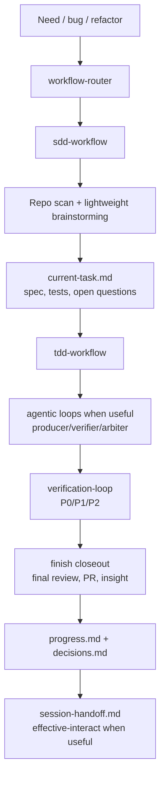

# Capability Map

Harness Hub exposes four product surfaces:

- a personal distributed skill set under `skills/`;
- one supported user-facing target path, `standard`, backed by the internal `harness/minimal/` template;
- a lifecycle CLI that can analyze, initialize, validate, self-check, install, update, status-check, and remove managed target-repo assets;
- a first-class source-backed post publishing domain under `harness-hub source-post <action>`.

The product also keeps workflow, agentic loops, and Loop separate. Workflow owners define the development lifecycle. Agentic loops split material stage work into Producer, Verifier, Arbiter, and Main Agent Decision evidence. Loop evaluates concrete continue/interrupt decisions and records auditable ledgers; it does not replace SDD, TDD, closeout, PR, or handoff stages.

It also owns explicit higher-level repo capabilities: agent dev harness bootstrap through `init-harness`, standard harness validation for Loop and LLM Wiki context assets, and source-backed post publishing through `harness-hub source-post`.

For the default requirement-to-delivery lane, see [Development Workflow](development-workflow.md). It explains how `workflow-router`, `sdd-workflow`, lightweight brainstorming, `tdd-workflow`, validation helpers, `effective-interact`, and `.harness-hub/state/` fit together during normal feature, bug-fix, refactor, and product-change work.

## Default Development Flow

## CLI Commands

| Command | Mutates target? | Purpose |
|---|---:|---|
| `harness-hub check <target>` | No | Report CLI package freshness, target lock-managed component freshness, and explicit CodeGraph/Headroom configuration advice without applying updates or installing tools. |
| `harness-hub self-check <target>` | No | Aggregate read-only health status, split hard failures from advisory items, and run strict harness validation only for initialized harness targets unless explicitly requested. |
| `harness-hub analyze <target>` | No | Detect existing standard skills, missing capabilities, conflicts, and recommendations. |
| `harness-hub analyze <target> --harness` | No | Detect repo harness gaps, existing root harness evidence, and initialization recommendations. |
| `harness-hub init-harness <target> --dry-run` | No | Preview root harness initialization without writing files or lock state. |
| `harness-hub init-harness <target> --yes` | Yes | Write the standard target harness files after blockers pass and record ownership in `.harness-hub/lock.json`. |
| `harness-hub validate-harness <target>` | No | Validate required standard harness files, QA boundaries, agent architecture boundaries, skill trigger hygiene, Loop control-plane assets, the five harness subsystems, and a structural benchmark. |
| `harness-hub loop evaluate <target> --input action.json` | No by default; Yes with `--yes` | Evaluate one action against the Loop interrupt policy. Return `continue` or `interrupt`; append `.harness-hub/state/interrupt-decisions.jsonl` only with `--yes`. |
| `harness-hub loop schedule <target> --input actions.jsonl` | No by default; Yes with `--yes` | Evaluate a queue of action intents, select the next `continue` action, and append loop-run plus decision ledgers only with `--yes`. |
| `harness-hub loop required <target>` | No | Derive required closeout loops from dirty worktree paths or `--base/--head` commit ranges and return a non-zero gate when review evidence is required before handoff. |
| `harness-hub loop run-start/agent-record/lease-check/collect-trace/integrate <target> --input file.json` | No by default; Yes with `--yes` | Record ignored local subagent orchestration state under `.harness-hub/state/runs/<runId>/`, enforce non-overlapping path leases for current-worktree writes, collect Codex/Claude trace summaries, and write a main-agent integration record. |
| `harness-hub loop verify <target> --input verify.json` | No | Verify run, agent, and integration evidence against required loops; return a non-zero gate when evidence is missing or blocked. |
| `harness-hub activate-agents <target> --dry-run` | No | Preview syncing installed project-local skills into `.codex/skills` and `.claude/skills` for local agent metadata activation. |
| `harness-hub activate-agents <target> --yes` | Yes | Write only the target repository's local `.codex/skills` and `.claude/skills` activation caches; no global skills and no lock ownership changes. |
| `harness-hub agent-hooks plan <target>` | No | Report Codex and Claude Code advisory hook templates, intended host-local destination files, existing-config review requirements, and manual adoption steps without writing host config or enabling blocking hooks. |
| `harness-hub install <target> --target standard --dry-run` | No | Preview managed installation of every target-distributed standard skill. |
| `harness-hub install <target> --target standard --yes` | Yes | Copy every managed standard skill and write `.harness-hub/lock.json`. |
| `harness-hub init-harness <target> --target standard --dry-run` | No | Preview standard skill installation plus canonical `AGENTS.md` and importing `CLAUDE.md` root harness files for Codex and Claude Code. |
| `harness-hub init-harness <target> --target standard --yes` | Yes | Install standard skills, write managed root harness files, and validate the harness. |
| `harness-hub validate-harness <target> --json` | No | Check required harness files, canonical root agent instructions and `CLAUDE.md` import, current-state file sizes, QA boundaries, agent architecture boundaries, skill trigger hygiene, five-subsystem assessment, project verification detection, and structural benchmark results. |
| `harness-hub source-post generate <target> --input file --json` | Yes | Validate a structured source record, write post metadata, adapt through `effective-interact`, and generate public post HTML. |
| `harness-hub source-post build <target> --json` | Yes | Build `site/index.html`, `site/source-posts/index.html`, and `site/source-posts/index.json` from post metadata. |
| `harness-hub source-post validate <target> --json` | No | Validate UTF-8, source attribution, fact/inference separation, links, excerpt size, indexes, and public artifact boundaries. |
| `harness-hub source-post publish <target> --dry-run --json` | No | Run Pages publish preflight for workflow, Pages output, source metadata, branch, and worktree state. |
| `harness-hub status <target>` | No | Compare lock records with current files and hub versions. |
| `harness-hub update <target> --dry-run` | No | Plan updates for managed skills. |
| `harness-hub update <target> --yes` | Yes | Update managed, unmodified files. |
| `harness-hub remove <target> --dry-run` | No | Preview removal of lock-recorded files. |
| `harness-hub remove <target> --yes` | Yes | Remove only managed files recorded in `.harness-hub/lock.json`. |

## Install Surface

Harness Hub has one personal target migration surface and one user-facing target path: `standard`. No named skill variants, harness pack levels, reduced tiers, bundle selectors, language-specific targets, or team harness levels exist. `harness:minimal` and `harness/minimal/` are internal component/template identifiers for the root harness files installed by `init-harness --target standard`; they are not a second target path. The CLI installs the complete target-distributed standard skill set: `kind: "skill"` components in `capabilities/index.json` whose source lives under `skills/<name>/` and whose `distribution` is absent or `target`. Components marked `hub-internal` stay local to the Harness Hub source checkout. Confirmed install overwrites same-name skill directories and records the new managed files in `.harness-hub/lock.json`.

Harness components use explicit lifecycle commands. `install` never writes root harness files or worktree-local state. `init-harness --target standard --yes` is the one-step migration path: it installs the target-distributed standard skill and routing surface, writes stable files such as canonical `AGENTS.md`, importing `CLAUDE.md`, `feature_list.json`, `clean-state-checklist.md`, `definition-of-done.md`, `evaluator-rubric.md`, `quality-document.md`, and `scripts/harness-validate.mjs`, writes ignored worktree-local progress, decision, current-task, handoff, Loop run, interrupt-decision, capability-event, and subagent run state under `.harness-hub/state/`, initializes the LLM Wiki context pack under `.harness-hub/context/`, validates the harness, and records confirmed writes as harness components in the same lock. It does not copy Harness Hub source-repo packaging or maintenance artifacts such as `.claude-plugin/`, root `openspec/`, `docs/`, `config/`, `package.json`, README files, or this repo's source tree into target roots. `activate-agents --yes` is a separate host-local activation cache sync from `skills/` to `.codex/skills` and `.claude/skills`; it is not global installation and is not a managed capability target. Local state files, preserved wiki content files, and agent activation cache files are not treated as content-drift blockers. The standard harness now records PR closeout policy, agentic loop evidence policy, Loop interrupt policy, finish closeout review/insight gates, main-agent auto-arbitration, freshness/stale-read gates, and LLM Wiki context rules; the CLI exposes `loop evaluate` / `loop schedule`, `loop required` / `loop verify`, and local orchestration state commands so autonomous loop actions have explicit mergeability, CI/check-run, risk, path-lease, trace, required-review, and human-checkpoint evidence before final delivery.

`scripts/harness-agent-gate.mjs` is the first source-distributed control-plane adapter. It maps host lifecycle event timing to existing Harness Hub routing, advisory, risk, and closeout evidence checks without creating a new workflow owner, hook installer, or agentic loop type. It is side-effect free and advisory by default; `--enforce` is an explicit caller choice for deterministic blocker exit codes and does not waive the separate security review required before default blocking hooks.

`harness-agent-hook` adapts Codex and Claude Code hook stdin/stdout conventions to that shared gate. The source templates in `harness/agent-hooks/` are review material only: they are packaged for explicit adoption, omit `--enforce`, avoid subagent-dispatching hook types, and do not create `.codex/` or `.claude/` host-local config during install, activation, check, or validation.

`harness-hub agent-hooks plan` is the read-only CLI bridge between packaged review material and host-local adoption. It produces a machine-readable plan for Codex and Claude Code destinations, reports existing configs as review-required instead of overwriting them, rejects confirmation flags, refuses report output paths containing `.codex/` or `.claude/` host directories, and leaves trust, copying, and blocking-mode enablement outside the default lifecycle.

Source-post publishing is a first-class product domain, but it is intentionally outside the target managed install set. Its public source lives under Git-only `site/`; ignored local artifacts such as `.harness-hub/reports/` and `skills/effective-interact/artifacts/` are not valid Pages sources.

## Atomic Capability Candidate Map

This map separates current installable capabilities from source-backed atom candidates. It is intentionally not an install graph or future pack menu. Promote candidates into `capabilities/index.json` only after source review, routing placement, and lifecycle-risk placement. Harness candidates must improve the single `standard` path or stay out of the install surface.

| Capability area | Current installable coverage | Source-backed atom candidates | Gap and decision |
|---|---|---|---|
| Planning, specs, and product clarification | `workflow-router`, `sdd-workflow`, `product-capability`, `grill-me`, OpenSpec formal skills, LLM Wiki context pack | User-selected/reference: Matt Pocock `design-an-interface`, `request-refactor-plan`, `ubiquitous-language`, `grill-with-docs`, `domain-modeling`, `to-prd`, `zoom-out`; Superpowers `brainstorming`, `writing-plans` | Strong coverage. Candidate work should dedupe against SDD, OpenSpec, and the standard context pack rather than add broad triggers. Matt `domain-modeling` is source material for docs-consistency and human-confirmed LLM Wiki context updates, not a direct `CONTEXT.md` writer. Ralph PRD/story-loop skills were retired because native Codex and Claude Code goal/story workflows now cover that lane. |
| Implementation workflow and engineering governance | `sdd-workflow`, `tdd-workflow`, `prototype`, `verification-loop`, `karpathy-guidelines`, `ponytail`, lifecycle CLI, agentic loop policy | User-selected/reference: Matt Pocock `prototype`, `tdd`, `codebase-design`, `improve-codebase-architecture`, `resolving-merge-conflicts`, `scaffold-exercises`; Superpowers `executing-plans`, `finishing-a-development-branch`, `using-git-worktrees`, `subagent-driven-development`, `writing-skills`; `vercel-labs/skills` `find-skills`; `multica-ai/andrej-karpathy-skills`; `DietrichGebert/ponytail` | Strong coverage. Treat Superpowers as source patterns for orchestration policy, not default always-on skills. Karpathy guidelines are a helper baseline, not another lifecycle owner. Ponytail owns coding minimalism: YAGNI, reuse, stdlib/native/already-installed dependencies, shortest correct diffs, and over-engineering review. Matt `codebase-design` and `improve-codebase-architecture` are high-priority source ideas for review/refactor and closeout technical-debt rubrics. Agentic loops stay stage mechanics, not a new workflow owner. |
| Debugging, verification, and review | `diagnosis-workflow`, `diagnose`, `review-workflow`, `compound-code-review`, `security-review`, `verification-loop`, `webapp-testing`, `e2e-testing`, `workflow-router` agentic-loop evidence checks | User-selected: Superpowers `systematic-debugging`, `verification-before-completion`, `requesting-code-review`, `receiving-code-review`; Vercel `web-design-guidelines` | Strong coverage. `web-design-guidelines` remains a good UI audit atom candidate. |
| Frontend and visual artifacts | `frontend-design`, `design-taste-frontend`, `clone-website`, `web-artifacts-builder`, `frontend-slides`, `frontend-patterns`, `effective-interact`, `web-design-guidelines`, `theme-factory`, `slack-gif-creator` | User-selected: `frontend-slides`, Michal Vavra `agent-browser`, `frontend-design`, `html-tools`; Anthropic `algorithmic-art`, `canvas-design`, `frontend-design`, `slack-gif-creator`, `theme-factory`, `web-artifacts-builder`, `webapp-testing`; Leonxlnx `taste-skill`; `JCodesMore/ai-website-cloner-template` | `taste-skill` is now installed as a narrow `design-taste-frontend` taste layer for landing pages, portfolios, marketing pages, and redesigns. `clone-website` covers explicit authorized website reconstruction only; generic frontend creation still routes to `frontend-design`. |
| Writing, handoff, knowledge, and learning | `insight`, `doc-coauthoring`, `internal-comms`, `stop-slop`, `handoff`, `quick-learn`, `answer-workflow`, `documentation-lookup`, `effective-interact`, LLM Wiki context pack in the standard harness | User-selected/reference: Matt Pocock `writing-beats`, `writing-fragments`, `writing-shape`, `edit-article`, `handoff`, `teach`, `writing-great-skills`; Anthropic `doc-coauthoring`, `internal-comms`, `brand-guidelines`; hardikpandya `stop-slop`; local project interaction audit need; evaluated learning skills including `teach-me`, `agent-tutor-skill`, `RetainCraft`, `learn-codebase`, `learn-anything`, `DeepTutor`, and `codebase-to-course`; Cline/Roo-style memory-bank patterns; Obsidian Markdown vault workflow; Basic Memory and Supermemory as memory architecture references | Filled collaborative doc, internal comms, private repository interaction audits, stable Markdown wiki initialization, contradiction/update logs, portable Obsidian profile, source-backed personal learning projects, and narrow English prose AI-tell cleanup gaps. Matt `teach` overlaps `quick-learn`; the evaluated learning set informed `quick-learn` without importing host-specific runtimes. Matt `writing-great-skills` is source material for skill-quality guidance and evals. `insight` is private/read-only by default; the LLM Wiki stores durable project knowledge only and requires human-confirmed writes; `stop-slop` is a strong style editor, not a default rule for specs, status reports, Chinese output, or code explanation. |
| Release and source monitoring | `package-release-sniffer`, `documentation-lookup`, `answer-workflow`, `source-post` | Local recurring need: sniff newly published AI/developer-tool packages before they appear in broad news or trend lists | `package-release-sniffer` fills the primary-source package registry and release-feed discovery gap while staying source-only. It does not install registry clients, hooks, credentials, monitors, or package publishing behavior. |
| Documents, spreadsheets, slides, and PDFs | No installable Harness Hub atoms. External app skills exist in this Codex environment, but they are not repo-distributed Harness Hub components. | Anthropic `docx`, `pdf`, `pptx`, `xlsx` | Clear capability gap. Treat as high-value source candidates, but source-available licensing requires review before copying or redistributing. |
| Agent platform, API, and skill authoring | `skill-quality-inventory`, `documentation-lookup`, `claude-api`, `mcp-builder`, `skill-creator`; Hub source-only: `hub-maintenance-workflow` | Anthropic `claude-api`, `mcp-builder`, `skill-creator`; Matt Pocock `writing-great-skills`; Superpowers `writing-skills`; ECC stocktake and agent-architecture audit patterns | Filled MCP, provider-specific Claude API, and skill-authoring gaps with explicit atoms. `hub-maintenance-workflow` is `hub-internal` and must not migrate to target repositories. `claude-api` remains live-doc-first because API details change. Matt `writing-great-skills` should improve local skill-quality guide/evals rather than become a second authoring skill. ECC-style stocktake and trigger-noise audits are useful source ideas for minimal-path quality gates, not a separate governance tier. |
| Repo harness initialization and governance | `harness-quality-check`, `analyze --harness`, `init-harness`, `validate-harness`, lock-backed status/update/remove, Loop control-plane policy/evals/state ledgers, LLM Wiki context validation, `harness/website-cloner` as explicit smoke scaffold | `walkinglabs/learn-harness-engineering`, `revfactory/harness`, ECC, and similar harness sources as evaluated reference material; `JCodesMore/ai-website-cloner-template` as website reconstruction source; local Codex workflow-course reflection | `harness-quality-check` now composes existing self-check, readiness, harness validation, and skill-quality evidence into advisory HTML reports. Keep the standard harness installable through explicit commands only. High-ROI ideas such as five-subsystem assessment, structural benchmarks, team-architecture patterns, QA boundary checks, stocktake workflows, trigger-noise audits, auditable Loop interrupt rules, and stable context-pack linting fold into the same `standard` path through `validate-harness`; do not create advanced packs or optional levels. Website-cloner is an explicit high-risk scaffold, not part of default skill install or ordinary frontend routing. |
| External tools and enterprise integrations | `check.externalTools` and `analyze --agent-readiness` provide advisory CodeGraph/Headroom setup signals; no installable Harness Hub components. | User-selected: `colbymchenry/codegraph`, `chopratejas/headroom`, archived Michal Vavra `asncli`, `gogcli`, `snowcli`; CE Slack/release/session candidates from the broader source pool | Keep explicit-only until connector, credential, and side-effect boundaries are specified. CodeGraph and Headroom advice stays manual/reviewed rather than lock-managed. |

## Local Alignment Notes

Current strengths:

- Workflow ownership is clear: `workflow-router` selects one owner, then owner workflows call atoms.
- Normal change work now has an explicit development lane: requirement intake, repo/source inspection, lightweight brainstorming, spec and P0/P1/P2 test matrix, TDD execution, validation, and state-file handoff.
- Repo harness ownership is explicit: root files are initialized only through `init-harness --target standard`, not through default skill installation.
- Engineering lifecycle coverage is strong: SDD, TDD, Karpathy-style coding behavior guardrails, Ponytail coding minimalism, P0/P1/P2 validation priorities, Web browser acceptance, finish closeout, PR status closeout, diagnosis, review, verification, handoff, and Harness Hub maintenance are all installable.
- Agentic loop coverage is now explicit: material stages can record Producer, Verifier, Arbiter, and Main Agent Decision evidence, with read-only arbitration and host-specific Codex/Claude Code invocation details kept outside generic skill bodies.
- Web/artifact coverage is strong after adding `theme-factory` and `design-taste-frontend`; production UI, frontend taste direction, standalone artifacts, slides, one-off browser checks, agent-run Web browser acceptance, and durable E2E have separate lanes. `effective-interact` also has a report-only aesthetic preflight derived from `taste-skill`.
- Writing coverage is now viable for docs, internal comms, and narrow English prose cleanup after adding `doc-coauthoring`, `internal-comms`, and `stop-slop`.
- Repository interaction audit coverage now has a private local lane: `insight` collects project-related Codex / Claude Code traces, separates confirmed from candidate evidence, and produces ignored reports without mutating projects, memory, schedules, remotes, or tracked docs.
- Release/source monitoring now has a small package-release lane: `package-release-sniffer` handles primary-source registry and release-feed discovery for AI/developer-tool packages without taking on implementation or automation side effects.
- Repo/harness quality review now has an advisory HTML lane: `harness-quality-check` composes existing deterministic checks for Hub source and target repositories without adding enforcement, schedules, hooks, or remote writes.
- Context engineering now has a standard target substrate: `.harness-hub/context/` initializes a schema, stable wiki pages, contradiction/update logs, and a portable Obsidian profile while preserving wiki content file-by-file during updates.
- Platform-extension coverage now has explicit atoms for Claude API, MCP servers, and skill authoring.
- Closeout learning now has a lane: `insight` can audit tool-calling quality, repeated manual corrections, doc/code conflicts, and whether the lesson should become a project rule, validation case, documentation, automation check, follow-up task, or for this source checkout only a skill/source-record change; Hermes-style self-evolution remains reference-only source material.

Known gaps:

- Native document/spreadsheet/PDF/PPT editing remains a distribution gap because Anthropic `docx`, `pdf`, `pptx`, and `xlsx` are source-available, not open source.
- Standalone brainstorming remains intentionally uninstalled. It is currently an SDD phase action composed from repo inspection, direction comparison, `grill-me`, `prototype`, and `product-capability`; promote it only if repeated routing evidence proves a bounded helper gap.
- External harness, team-architecture, and stocktake ideas still need careful extraction; accepted ideas must improve the `standard` path instead of creating another install level. Website-cloner is intentionally explicit and high-risk because it touches external sites, browser evidence, and potential third-party brand assets.
- Cloud/provider coverage is Vercel-heavy; AWS/GCP/Azure, data/ML operations, security operations, and enterprise SaaS integrations still need additional reviewed sources.
- Brand workflow remains generic-only; Anthropic `brand-guidelines` was not imported because it is Anthropic-specific.
- `docs/standard-target-boundary.md` documents the single-target policy; only `standard` is user-facing and explicit-init capable.

Known redundancies:

- Anthropic `frontend-design`, `web-artifacts-builder`, and `webapp-testing` overlap existing Harness Hub atoms and should not be duplicated.
- Superpowers remains useful as orchestration source material, but direct broad-trigger imports would duplicate workflow-owner behavior.
- ECC is excluded from the candidate pool; existing local ECC-derived lineage should be replaced gradually only when a better reviewed atom exists.

## Candidate Intake Rules

- A selected atom is not installable until its source license, trigger contract, side effects, overlaps, and lifecycle risk are recorded.
- Prefer importing or adapting one bounded skill at a time over importing a repo or plugin bundle.
- Preserve upstream skill bodies by default; put local routing and safety decisions in the overlay unless the upstream body blocks safe personal distribution.
- Keep host-specific paths, hooks, UI metadata, and credential assumptions outside local routing/workflow layers.
- Do not create a new install level, harness pack tier, or selector; fold the idea into the standard target path or keep it out.
- Document skills from `anthropics/skills` fill a real map gap, but `docx`, `pdf`, `pptx`, and `xlsx` require license review before redistribution.

## Routing Anchors

- `workflow-router` owns intent recognition for non-trivial work and must hand off to exactly one owner.
- `sdd-workflow` owns SDD-first change work: align user need, gather source material, write spec/acceptance, write an executable plan, clean only approved files, implement, test, finish closeout, and deliver.
- Agentic loops are workflow-stage mechanics available to owner workflows; they are not router states or standalone skill owners.
- `answer-workflow`, `diagnosis-workflow`, `review-workflow`, and `delivery-workflow` own their matching target lifecycle states. `hub-maintenance-workflow` owns Harness Hub source maintenance only and is not target-distributed.
- `insight`, `doc-coauthoring`, `internal-comms`, `stop-slop`, `design-taste-frontend`, `theme-factory`, `package-release-sniffer`, `harness-quality-check`, `claude-api`, `mcp-builder`, `skill-creator`, `ponytail`, and `slack-gif-creator` are helper atoms, not top-level workflow owners.
- `karpathy-guidelines` is a helper behavior baseline for assumption surfacing, simplicity, surgical changes, and verification criteria inside implementation, review, or refactor work.
- `ponytail` is the helper behavior baseline for coding minimalism inside implementation, review, or refactor work. It does not import upstream host hooks, persistent mode state, statusline setup, slash-command adapters, MCP proxy, or multi-host plugin packaging into the standard skill tree.
- `diagnose` owns unknown runtime bugs and performance regressions.
- `tdd-workflow` owns known behavior changes that should be implemented through tests.
- `webapp-testing` owns one-off local browser inspection and agent-run Web browser acceptance evidence; `e2e-testing` owns durable Playwright suites.
- `prototype` owns disposable learning artifacts only.
- `verification-loop` owns final command gates.
- `compound-code-review` owns deep review reports.
- `effective-interact` owns Chinese-first complex communication structure: plain briefs, structured Markdown, visual Markdown, ignored long-task fact ledgers, and HTML artifacts for material repo/skill handoffs, option approvals, implementation plans, PR writeups, architecture/dependency/milestone maps, structure trees, status/incident dashboards, research explainers, review artifacts, and lightweight export editors. Its HTML reports should start from visual language that reduces interaction time and information loss, not Markdown-in-HTML. `grill-me` owns pressure testing, `frontend-design` owns production UI, and `frontend-slides` owns decks.
- `insight` owns private repository interaction audits from local Codex / Claude Code traces. It does not own public external-source posts, one-run agent failure diagnosis, harness readiness audits, or ordinary repo explanations.
- `design-taste-frontend` owns anti-template visual direction and pre-flight critique for landing pages, portfolios, marketing pages, and redesigns. It should not own dashboards, data tables, multi-step product UI, routine frontend logic, HTML reports, or decks.
- `stop-slop` owns English prose AI-tell cleanup only. It should not become a default writing policy for technical specs, ordinary documentation, Chinese output, code explanation, or status reports.
- `clone-website` owns explicit authorized website reconstruction only. It should not own generic redesign, visual inspiration, scraping, impersonation, or production UI work that starts from a new product brief.

## Metadata Rules

`capabilities/index.json` is the component graph. Skill components use:

- `path`: source path under `skills/<name>`;
- `detects`: standard target evidence such as `skills/<name>/SKILL.md`;
- `agents`: currently `["standard"]` for lock compatibility with older schema field names;
- `distribution`: optional install boundary; omitted or `target` migrates to target repositories, `hub-internal` stays in this source checkout, and `optional` is reserved for future explicit includes;
- `risk`: lifecycle risk for install/update/remove decisions.

Do not add host-specific install directories to the capability graph. Packaging for a host belongs in that host's manifest layer, such as `.claude-plugin/`. Local Harness Hub dogfooding uses `scripts/sync-agent-skills.mjs` to generate ignored `.codex/skills/` and `.claude/skills/` mirrors from the standard source tree; target repositories use `harness-hub activate-agents <target> --yes` only as an explicit project-local agent cache sync after skills are installed. `.codex/` and `.claude/` stay local and are not installable capability metadata. Direct user-level slash invocation is a separate host-owned surface, such as `$CODEX_HOME/skills/`, and must not be inferred from project-local mirrors or represented in `capabilities/index.json`. Subagents and hooks are workflow-owned optimizations: subagents need independent scopes, and hooks stay advisory until reviewed and approved.

Harness components currently live under `harness/minimal/`, but they are not part of default standard skill install. They are copied only by explicit harness lifecycle commands and must stay free of host-local runner metadata.
