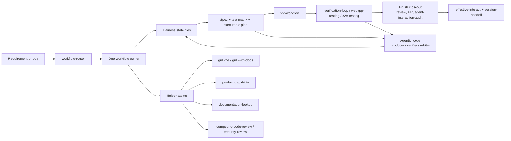

# Development Workflow

Harness Hub's default development lane is SDD-first with embedded TDD. The goal is to make long Codex sessions stable: the agent should discover context, choose a direction, align the spec, test through public behavior, close the work deliberately, and leave enough local state for the next session to continue without replaying chat.

Workflow and Loop are separate layers. The workflow is the canonical development lifecycle and owner model. Loop is the auditable control plane that decides when an action may continue, when it must interrupt for human review, and which ledgers record the decision. Loop must not replace the workflow stages or let autonomous execution bypass SDD, TDD, review, PR, or handoff gates.

This document is the practical entrypoint for change work. Routing details remain in [Skill Routing](skill-routing.md), lifecycle source evidence remains in [Workflow Source Dossier](workflow-source-dossier.md), installable agentic loop rules live in [`workflow-router/references/agentic-loops.md`](../skills/workflow-router/references/agentic-loops.md), and source-level examples live in [Agentic Loop Catalog](agentic-loop-catalog.md). Target-repo state lives under `.harness-hub/state/` after `init-harness`.

## Current State Model

Harness Hub has three stateful layers today:

- workflow state: `workflow-router` classifies a request into one owner state and advisory phase gates check whether the current task has enough scope, spec, acceptance, validation, and closeout evidence;
- task durability state: `current-task.md`, `decisions.md`, `progress.md`, and `session-handoff.md` record the autonomy envelope, accepted decisions, validation evidence, freshness gate, stale-read gate, blockers, and restart path instead of leaving them only in chat memory;
- loop evidence state: agentic loop records capture Producer, Verifier, Arbiter, iteration, maxIterations, stop condition, evidence, verdict, and Main Agent Decision;
- loop orchestration state: `harness-hub loop required`, `run-start`, `agent-record`, `lease-check`, `collect-trace`, `integrate`, and `verify` derive required review loops from dirty paths or base/head diffs, record per-run and per-agent state under ignored `.harness-hub/state/runs/<runId>/`, and block handoff when evidence is missing;
- Loop control state: `harness-hub loop evaluate` and `loop schedule` write continue/interrupt decisions to local JSONL ledgers only when explicitly confirmed.

This is not a daemon or automatic dispatcher. There is no retry scheduler, merge queue, or unattended hook that starts delegated agents. The local orchestration runtime now provides deterministic gates for required loops and evidence verification; the active workflow owner still decides when to spawn agents and how to integrate their output. For non-trivial work, the main agent should still aggressively but controllably look for independent delegated-agent splits that reduce context pressure or improve evidence quality.

## Composable Skill Layers

Harness Hub adapts the Matt Pocock README model as a local layering rule: small skills should either orchestrate a bounded user-requested moment or provide reusable model-invoked discipline under a selected owner. They should not seize the whole process when an existing workflow owner can compose them.

- Owner workflows are the process spine: `sdd-workflow`, `diagnosis-workflow`, `review-workflow`, `delivery-workflow`, and `hub-maintenance-workflow`.
- Orchestration helpers shape a moment in the workflow: `grill-me`, `grill-with-docs`, `prototype`, `product-capability`, `doc-coauthoring`, and `effective-interact`.
- Discipline helpers hold reusable engineering habits: `tdd-workflow`, `diagnose`, `verification-loop`, `karpathy-guidelines`, `ponytail`, `coding-standards`, `compound-code-review`, and provider/domain atoms.

When importing or adapting upstream skills, prefer this composition model over broad process ownership. A user-invoked upstream flow may become a local helper only when its side effects, persistence model, and trigger boundary fit Harness Hub.

## Capability Map



## Phase Contract

| Phase | Agent behavior | Harness state write | Typical helpers |
|---|---|---|---|
| 0. Harness and freshness gate | Verify the target has the standard harness files, run the freshness gate, and run `node scripts/harness-validate.mjs` before product edits. `git fetch --prune`, clean fast-forward, and creating a named branch from detached `HEAD` are allowed; dirty, diverged, conflicted, or missing-upstream states must be recorded and resolved before edits. | Preserve existing local state; fill missing `current-task.md` fields before coding, including branch, freshness status, autonomy envelope, and validation plan. | `workflow-router` |
| 1. Requirement intake | Restate actor, outcome, pain, constraints, non-goals, and success target. Inspect repo evidence before asking. | `current-task.md`: Goal, assumptions, non-goals, allowed/forbidden paths. | `answer-workflow` for evidence lookup |
| 2. Discovery and brainstorming | Produce 2-3 viable directions from repo context, recommend one, and record rejected alternatives. Default-consider one pressure-test pass for non-trivial changes; use `grill-with-docs` when the answers should update shared language, context, ADR candidates, or code/docs contradictions. Do not add a standalone brainstorming skill unless a routing gap proves it. | `current-task.md`: Discovery and brainstorming; `decisions.md`: accepted direction and alternatives. | `grill-me`, `grill-with-docs`, `prototype`, `product-capability` |
| 3. Spec and acceptance | Define target behavior, boundaries, compatibility, acceptance criteria, and validation commands. | `current-task.md`: Target spec, acceptance criteria, validation tiers, web acceptance if relevant. | `product-capability`, OpenSpec only when explicit |
| 4. Detail alignment | Ask only blocking open questions. Every user-visible or irreversible detail must be clear before implementation. | `current-task.md`: Open questions and alignment status; `decisions.md`: resolved decisions. | `grill-me`, `grill-with-docs`, `effective-interact` |
| 5. TDD execution | Implement one public behavior at a time: RED, GREEN, REFACTOR. Keep changes narrow. | `progress.md`: plan checkpoints, validation records, blockers, checkpoint commit state. | `tdd-workflow`, `karpathy-guidelines` |
| 6. Verification and acceptance | Run P0, run or risk-assess P1, run or defer P2 with a reason. Browser-visible changes need agent-run browser acceptance. | `progress.md`: validation records, runtime signals, web acceptance, PR status. | `verification-loop`, `webapp-testing`, `e2e-testing` |
| 7. Finish closeout | Run the required closeout loop for every mutation, with evidence level based on changed paths. Small source/test changes still need implementation or test review evidence; workflow, harness, security, release, credential, permission, or remote-action paths need stronger isolated review. Run the stale-read gate before handoff. Drive PR work to merge-ready or explicitly authorized merge completion, and run `agent-interaction-audit` to audit tool-calling and workflow-learning evidence. Expose conflict, merge, technical-debt, and architecture-drift decisions instead of handling them silently. | `progress.md`: stale-read gate result, required loop result, final review findings, PR/merge readiness, agent interaction audit recommendations, workflow/skill candidates; `decisions.md`: durable rule or workflow changes. | `delivery-workflow`, `compound-code-review`, `agent-interaction-audit`, `skill-creator` |
| 8. Delivery and handoff | Report changes, evidence, stale-read result, residual risk, skipped checks, final review outcome, agent interaction audit recommendations, next action, and PR state when applicable. | `session-handoff.md`: status, changed files, validation, stale-read result, final review, agent interaction audit recommendations, residual risk, next action. | `delivery-workflow`, `effective-interact` |

## Agentic Loops

Agentic loops are stage-level mechanics inside the workflow, not a replacement for the workflow owner. For mutation work they are mandatory closeout gates; context isolation, fresh acceptance evidence, and parallel review determine the level and executor mode:

```text
Producer -> Verifier -> Arbiter -> Main Agent Decision
```

The loop roles are host-neutral. `delegated-agent` may be a host-native subagent, isolated session, browser run, CI check, deterministic command, or bounded worker. The main agent should default-consider subagent splits for non-trivial independent research, review, verification, stale-read checks, and leased disjoint write scopes; skip them when the task is tiny, the next step needs immediate main-agent judgment, tools are unavailable, or risk is too high. Arbiters are read-only and must not edit code, resolve conflicts, push, publish, merge, or make final user-facing decisions. Write-capable delegated agents may use the current worktree only after a path lease names their owned paths. The main agent owns integration and the final handoff.

Common loops include `plan-review`, `test-design`, `implementation-review`, `test-review`, `workflow-review`, `security-review`, `frontend-acceptance`, `diagnosis-regression`, `docs-consistency`, `pr-closeout`, and `agent-interaction-retro`. Record planned loops in `current-task.md`; before handoff, run `harness-hub loop required` or `harness-hub loop required --base <ref> --head <ref>` when the CLI runtime is available and either satisfy or explicitly record each required loop. Subagents record private runtime state under `.harness-hub/state/runs/<runId>/agents/<agentId>/`; path leases live under `.harness-hub/state/runs/<runId>/leases/`; the main agent writes the integration record and then summarizes actual loop evidence in `progress.md` and `session-handoff.md` under `Agentic Loop Records`. Subagent interruption questions go first to the main agent. The main agent may auto-arbitrate and continue when the action is inside allowed paths, write scopes are leased, side effects are local and reversible, validation is known, and evidence can be recorded. Escalate to the user for behavior, acceptance, scope, cost, data ownership, credentials, permissions, remote writes, publishing, PR/merge state, destructive non-managed content, or governance changes. When a loop may repeat, record `iteration`, `maxIterations`, and a stop condition so the main agent cannot silently keep asking for more reviews.

Host-specific execution details belong in [Codex agentic loops](host-adapters/codex-agentic-loops.md) and [Claude Code agentic loops](host-adapters/claude-code-agentic-loops.md), not in generic skill bodies.

## Finish Closeout

The finish closeout stage is a development stage, not a hidden automation. It happens after tests and acceptance evidence, before the final handoff.

Closeout has three required checks for development work that mutates files:

1. Final review: use `harness-hub loop required` to determine required loops from dirty paths or a base/head diff when available. Use subagent review lenses when the level calls for isolation and the scope is safe; small changes may use the lower evidence level, but must still record review or fallback evidence. Focus on technical debt, first-principles implementation fit, whether the increment drifted from project rules, and whether a refactor or warning should be surfaced before delivery. The main agent owns synthesis and must not delegate final decisions.
2. Stale-read gate: recheck `git status --short`, inspect changed paths, reread or diff task-critical files consulted earlier when they may have changed, and record the result or why stale reads cannot affect handoff.
3. PR and merge readiness: create or update the PR only when requested by the task, inspect mergeability, CI/check-runs, conflicts, and branch protection, and resolve in-scope blockers. Conflict decisions and risk must be visible to the user. Merge only when the user explicitly authorizes that remote mutation.
4. Agent interaction audit: invoke `agent-interaction-audit` or record why it is skipped. The audit should review whether tool calling stayed high-leverage, whether the agent repeated low-value lookup loops, whether docs and code disagree, which lessons should become harness rules or wiki entries, and whether this workflow should become a skill, source record, eval case, or change to an existing owner workflow.

External skill-evaluation systems such as Hermes-style self-evolution are source material for the agent interaction audit: prefer traces, eval cases, guardrails, and candidate skill records over importing a runtime or optimizer by default.

## P0/P1/P2 Test Planning

TDD is embedded in SDD. The accepted plan should contain a test matrix before production edits:

| Priority | Meaning | Examples | Handoff rule |
|---|---|---|---|
| P0 | Must pass before handoff. | New or changed behavior test, nearest suite, required typecheck/lint/build, required browser acceptance for Web UI. | Blocking unless the user changes scope. |
| P1 | Affected boundary confidence. | Integration, API, data-flow, module, migration, system, or cross-boundary checks. | Run or record a concrete risk assessment. |
| P2 | Hardening. | Broader regression, repeated runs, cross-browser/mobile, accessibility, performance, stress checks. | May defer with a reason and follow-up. |

The first RED test should prove one observable behavior through a public interface. If a direct test is impractical, define a deterministic substitute before implementation and record the reason.

## Open Question Discipline

The agent should ask questions only when the answer changes the next action or prevents unsafe assumptions. Good open questions force a decision:

- Which user-visible behavior is in scope for v1, and which is explicitly out?
- Is this state authoritative, derived, cached, or only display state?
- Which failure mode is acceptable, and which one must be blocked?
- Can this change alter data, cost, privacy, compatibility, release, rollback, or external side effects?

Use `grill-me` when the plan needs pressure testing. It batches every currently independent high-leverage question with a recommended answer and tradeoff, then asks dependency-bound questions after their prerequisites resolve. Use `grill-with-docs` when the interview should also propose glossary, context wiki, domain-model, ADR, or code/docs contradiction updates; that governed documentation variant keeps its one-question-at-a-time confirmation flow.

## State File Responsibilities

| File | Owns | Should not become |
|---|---|---|
| `.harness-hub/state/current-task.md` | Active goal, spec, test matrix, allowed paths, open questions, validation tiers, checkpoint policy. | A step-by-step progress log. |
| `.harness-hub/state/decisions.md` | Durable choices, rationale, alternatives, state-file impact, follow-up. | A scratchpad for every small implementation thought. |
| `.harness-hub/state/progress.md` | Current phase, completed work, validation records, runtime signals, stale-read gate, blockers, PR status. | A replacement for tests or evidence. |
| `.harness-hub/state/session-handoff.md` | Restart path, changed files, validation, stale-read result, final review, agent interaction audit recommendations, residual risk, next action. | A duplicate of the whole chat transcript. |
| `.harness-hub/state/runs/<runId>/` | Ignored per-loop runtime state: run metadata, per-agent state/events/results, path leases, host trace summaries, and integration records. | Durable source documentation or tracked project memory. |
| `quality-document.md` | Cross-session quality snapshot by product area and architecture layer. | A task-local checklist. |
| `evaluator-rubric.md` | Acceptance verdict for material implementation or review work. | A substitute for running validation. |

## Skill Extension Rules

New skills should enter the system only when they create a real routing or capability improvement.

| Candidate type | Register where | When valid |
|---|---|---|
| New workflow owner | `workflow-router`, `docs/skill-routing.md`, owner contract tests, `capabilities/index.json`. | Only if the existing six states cannot own the lifecycle without ambiguity. |
| Helper atom | `skills/<name>/SKILL.md`, `docs/skill-routing.md`, `docs/capability-map.md`, `capabilities/index.json`, focused routing tests. | Bounded trigger, clear side-effect boundary, no top-level ownership conflict. |
| Explicit-only workflow | `docs/skill-routing.md`, source records, optional skill if safe. | Useful but risky, rare, formal, or user-invoked only. |
| Source-only idea | `docs/source-projects.md` and possibly `docs/workflow-source-dossier.md`. | Useful reference but duplicate, unsafe, unclear license, or too broad for default distribution. |

Checklist before adding an installable skill:

1. Read upstream README, skill body, metadata, and license.
2. Compare against `skills/`, `docs/skill-routing.md`, and `capabilities/index.json`.
3. Decide owner/helper/explicit-only/source-only.
4. Preserve upstream skill content by default; put local behavior in routing docs or owner workflows.
5. Add capability metadata only for default-distributed components.
6. Add or update routing and contract tests when trigger behavior changes.
7. Run `powershell -ExecutionPolicy Bypass -File scripts\validate-skills.ps1 -SkipExternal`; run `bun run validate` when TypeScript, capabilities, CLI, or install behavior changes.

## Best Practice Summary

- Optimize for one clear owner, not many competing prompts.
- Prefer small composable helpers over process-owning imports; keep user control with one workflow owner.
- Treat shared domain language as an engineering asset: capture it through `grill-with-docs` only when it is durable enough for the LLM Wiki/state model.
- Treat the main agent as the orchestrator: split non-trivial independent work to subagents when it saves context or improves evidence, but keep final decisions local to the main agent.
- Start with a freshness gate and finish with a stale-read gate; important facts should be refreshed or explicitly judged unaffected before handoff.
- Brainstorm before spec lock-in, but record the chosen direction and rejected alternatives.
- Make tests part of the plan, not an afterthought.
- Treat feedback loops as the speed limit; if no honest feedback loop exists, surface the design or seam problem instead of pretending with shallow tests.
- Ask fewer questions, but make every question decision-forcing.
- Keep implementation boring: smallest scoped diff, public-behavior tests, refactor only while green.
- Invest in design during ordinary closeout: surface muddy modules, weak seams, and deep-module opportunities before they compound.
- Close deliberately: final review, PR/merge readiness, and agent interaction audit learning happen before the final handoff.
- Treat harness state as memory: current-task for the contract, decisions for rationale, progress for evidence, handoff for restart.
