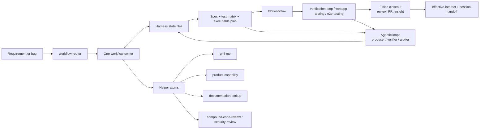

# Development Workflow

Harness Hub's default development lane is SDD-first with embedded TDD. The goal is to make long Codex sessions stable: the agent should discover context, choose a direction, align the spec, test through public behavior, close the work deliberately, and leave enough local state for the next session to continue without replaying chat.

Workflow and Loop are separate layers. The workflow is the canonical development lifecycle and owner model. Loop is the auditable control plane that decides when an action may continue, when it must interrupt for human review, and which ledgers record the decision. Loop must not replace the workflow stages or let autonomous execution bypass SDD, TDD, review, PR, or handoff gates.

This document is the practical entrypoint for change work. Routing details remain in [Skill Routing](skill-routing.md), lifecycle source evidence remains in [Workflow Source Dossier](workflow-source-dossier.md), installable agentic loop rules live in [`workflow-router/references/agentic-loops.md`](../skills/workflow-router/references/agentic-loops.md), and source-level examples live in [Agentic Loop Catalog](agentic-loop-catalog.md). Target-repo state lives under `.harness-hub/state/` after `init-harness`.

## Capability Map



## Phase Contract

| Phase | Agent behavior | Harness state write | Typical helpers |
|---|---|---|---|
| 0. Harness gate | Verify the target has the standard harness files and run `node scripts/harness-validate.mjs` before product edits. | Preserve existing local state; fill missing `current-task.md` fields before coding. | `workflow-router` |
| 1. Requirement intake | Restate actor, outcome, pain, constraints, non-goals, and success target. Inspect repo evidence before asking. | `current-task.md`: Goal, assumptions, non-goals, allowed/forbidden paths. | `answer-workflow` for evidence lookup |
| 2. Discovery and brainstorming | Produce 2-3 viable directions from repo context, recommend one, and record rejected alternatives. Do not add a standalone brainstorming skill unless a routing gap proves it. | `current-task.md`: Discovery and brainstorming; `decisions.md`: accepted direction and alternatives. | `grill-me`, `prototype`, `product-capability` |
| 3. Spec and acceptance | Define target behavior, boundaries, compatibility, acceptance criteria, and validation commands. | `current-task.md`: Target spec, acceptance criteria, validation tiers, web acceptance if relevant. | `product-capability`, OpenSpec only when explicit |
| 4. Detail alignment | Ask only blocking open questions. Every user-visible or irreversible detail must be clear before implementation. | `current-task.md`: Open questions and alignment status; `decisions.md`: resolved decisions. | `grill-me`, `effective-interact` |
| 5. TDD execution | Implement one public behavior at a time: RED, GREEN, REFACTOR. Keep changes narrow. | `progress.md`: plan checkpoints, validation records, blockers, checkpoint commit state. | `tdd-workflow`, `karpathy-guidelines` |
| 6. Verification and acceptance | Run P0, run or risk-assess P1, run or defer P2 with a reason. Browser-visible changes need agent-run browser acceptance. | `progress.md`: validation records, runtime signals, web acceptance, PR status. | `verification-loop`, `webapp-testing`, `e2e-testing` |
| 7. Finish closeout | Run a final independent review pass when the change is material, drive PR work to merge-ready or explicitly authorized merge completion, and run `insight` to audit tool-calling and workflow-learning evidence. Expose conflict, merge, and technical-debt decisions instead of handling them silently. | `progress.md`: final review findings, PR/merge readiness, insight recommendations, workflow/skill candidates; `decisions.md`: durable rule or workflow changes. | `delivery-workflow`, `compound-code-review`, `insight`, `skill-creator` |
| 8. Delivery and handoff | Report changes, evidence, residual risk, skipped checks, final review outcome, insight recommendations, next action, and PR state when applicable. | `session-handoff.md`: status, changed files, validation, final review, insight recommendations, residual risk, next action. | `delivery-workflow`, `effective-interact` |

## Agentic Loops

Agentic loops are stage-level mechanics inside the workflow, not a replacement for the workflow owner. Use them when context isolation, fresh acceptance evidence, or parallel review reduces risk:

```text
Producer -> Verifier -> Arbiter -> Main Agent Decision
```

The loop roles are host-neutral. `delegated-agent` may be a host-native subagent, isolated session, browser run, CI check, deterministic command, or bounded worker. Arbiters are read-only and must not edit code, resolve conflicts, push, publish, merge, or make final user-facing decisions. The main agent owns integration and the final handoff.

Common loops include `plan-review`, `test-design`, `implementation-review`, `frontend-acceptance`, `diagnosis-regression`, `pr-closeout`, and `insight-retro`. Record planned loops in `current-task.md` and actual loop evidence in `progress.md` and `session-handoff.md` under `Agentic Loop Records`.

Host-specific execution details belong in [Codex agentic loops](host-adapters/codex-agentic-loops.md) and [Claude Code agentic loops](host-adapters/claude-code-agentic-loops.md), not in generic skill bodies.

## Finish Closeout

The finish closeout stage is a development stage, not a hidden automation. It happens after tests and acceptance evidence, before the final handoff.

Closeout has three required checks for material development work:

1. Final review: use a subagent or independent review pass when available and scope-safe. Focus on technical debt, first-principles implementation fit, whether the increment drifted from project rules, and whether a refactor or warning should be surfaced before delivery. The main agent owns synthesis and must not delegate final decisions.
2. PR and merge readiness: create or update the PR only when requested by the task, inspect mergeability, CI/check-runs, conflicts, and branch protection, and resolve in-scope blockers. Conflict decisions and risk must be visible to the user. Merge only when the user explicitly authorizes that remote mutation.
3. Insight audit: invoke `insight` or record why it is skipped. The audit should review whether tool calling stayed high-leverage, whether the agent repeated low-value lookup loops, whether docs and code disagree, which lessons should become harness rules or wiki entries, and whether this workflow should become a skill, source record, eval case, or change to an existing owner workflow.

External skill-evaluation systems such as Hermes-style self-evolution are source material for the insight audit: prefer traces, eval cases, guardrails, and candidate skill records over importing a runtime or optimizer by default.

## P0/P1/P2 Test Planning

TDD is embedded in SDD. The accepted plan should contain a test matrix before production edits:

| Priority | Meaning | Examples | Handoff rule |
|---|---|---|---|
| P0 | Must pass before handoff. | New or changed behavior test, nearest suite, required typecheck/lint/build, required browser acceptance for Web UI. | Blocking unless the user changes scope. |
| P1 | Affected boundary confidence. | Integration, API, data-flow, module, migration, system, or cross-boundary checks. | Run or record a concrete risk assessment. |
| P2 | Hardening. | Broader regression, repeated runs, cross-browser/mobile, accessibility, performance, stress checks. | May defer with a reason and follow-up. |

The first RED test should prove one observable behavior through a public interface. If a direct test is impractical, define a deterministic substitute before implementation and record the reason.

## Open Question Discipline

The agent should ask questions only when the answer changes the next action or prevents unsafe assumptions. Good open questions force a decision:

- Which user-visible behavior is in scope for v1, and which is explicitly out?
- Is this state authoritative, derived, cached, or only display state?
- Which failure mode is acceptable, and which one must be blocked?
- Can this change alter data, cost, privacy, compatibility, release, rollback, or external side effects?

Use `grill-me` when the plan needs pressure testing. Ask one high-leverage question at a time, give the recommended answer, and explain the tradeoff.

## State File Responsibilities

| File | Owns | Should not become |
|---|---|---|
| `.harness-hub/state/current-task.md` | Active goal, spec, test matrix, allowed paths, open questions, validation tiers, checkpoint policy. | A step-by-step progress log. |
| `.harness-hub/state/decisions.md` | Durable choices, rationale, alternatives, state-file impact, follow-up. | A scratchpad for every small implementation thought. |
| `.harness-hub/state/progress.md` | Current phase, completed work, validation records, runtime signals, blockers, PR status. | A replacement for tests or evidence. |
| `.harness-hub/state/session-handoff.md` | Restart path, changed files, validation, final review, insight recommendations, residual risk, next action. | A duplicate of the whole chat transcript. |
| `quality-document.md` | Cross-session quality snapshot by product area and architecture layer. | A task-local checklist. |
| `evaluator-rubric.md` | Acceptance verdict for material implementation or review work. | A substitute for running validation. |

## Skill Extension Rules

New skills should enter the system only when they create a real routing or capability improvement.

| Candidate type | Register where | When valid |
|---|---|---|
| New workflow owner | `workflow-router`, `docs/skill-routing.md`, owner contract tests, `capabilities/index.json`. | Only if the existing six states cannot own the lifecycle without ambiguity. |
| Helper atom | `skills/<name>/SKILL.md`, `docs/skill-routing.md`, `docs/capability-map.md`, `capabilities/index.json`, focused routing tests. | Bounded trigger, clear side-effect boundary, no top-level ownership conflict. |
| Explicit-only workflow | `docs/skill-routing.md`, source records, optional skill if safe. | Useful but risky, rare, formal, or user-invoked only. |
| Source-only idea | `docs/source-projects.md` and possibly `docs/workflow-source-dossier.md`. | Useful reference but duplicate, unsafe, unclear license, or too broad for default distribution. |

Checklist before adding an installable skill:

1. Read upstream README, skill body, metadata, and license.
2. Compare against `skills/`, `docs/skill-routing.md`, and `capabilities/index.json`.
3. Decide owner/helper/explicit-only/source-only.
4. Preserve upstream skill content by default; put local behavior in routing docs or owner workflows.
5. Add capability metadata only for default-distributed components.
6. Add or update routing and contract tests when trigger behavior changes.
7. Run `powershell -ExecutionPolicy Bypass -File scripts\validate-skills.ps1 -SkipExternal`; run `bun run validate` when TypeScript, capabilities, CLI, or install behavior changes.

## Best Practice Summary

- Optimize for one clear owner, not many competing prompts.
- Brainstorm before spec lock-in, but record the chosen direction and rejected alternatives.
- Make tests part of the plan, not an afterthought.
- Ask fewer questions, but make every question decision-forcing.
- Keep implementation boring: smallest scoped diff, public-behavior tests, refactor only while green.
- Close deliberately: final review, PR/merge readiness, and insight learning happen before the final handoff.
- Treat harness state as memory: current-task for the contract, decisions for rationale, progress for evidence, handoff for restart.
